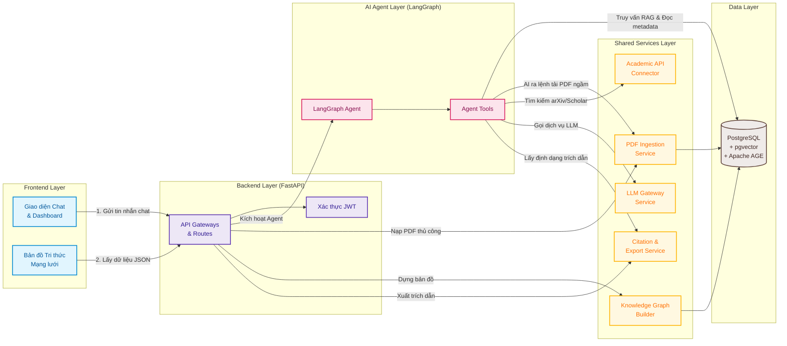
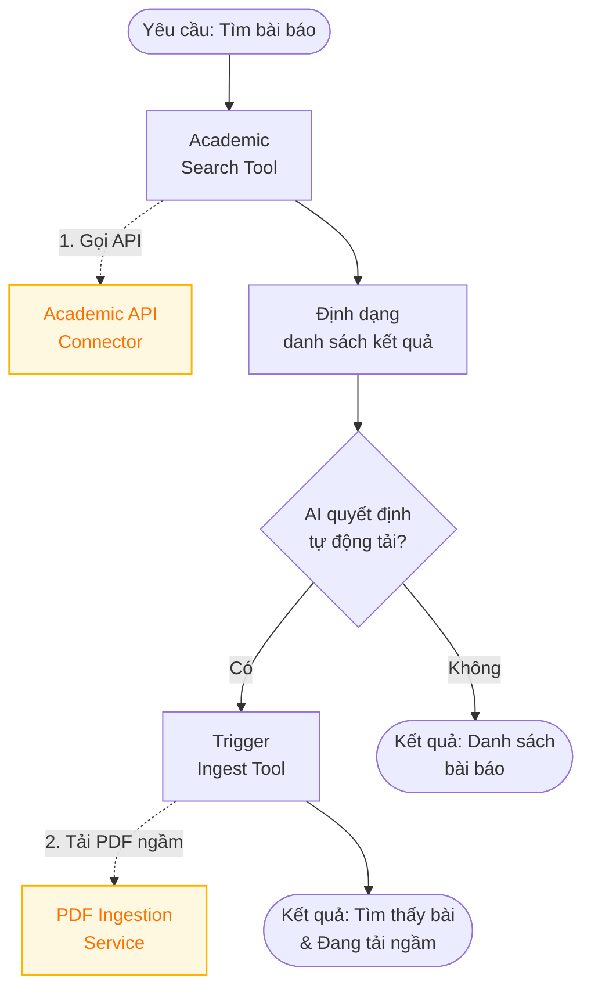
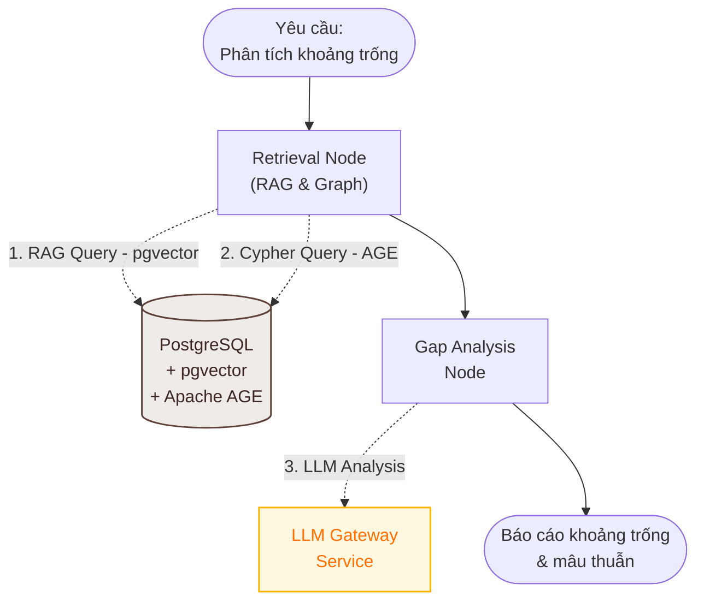
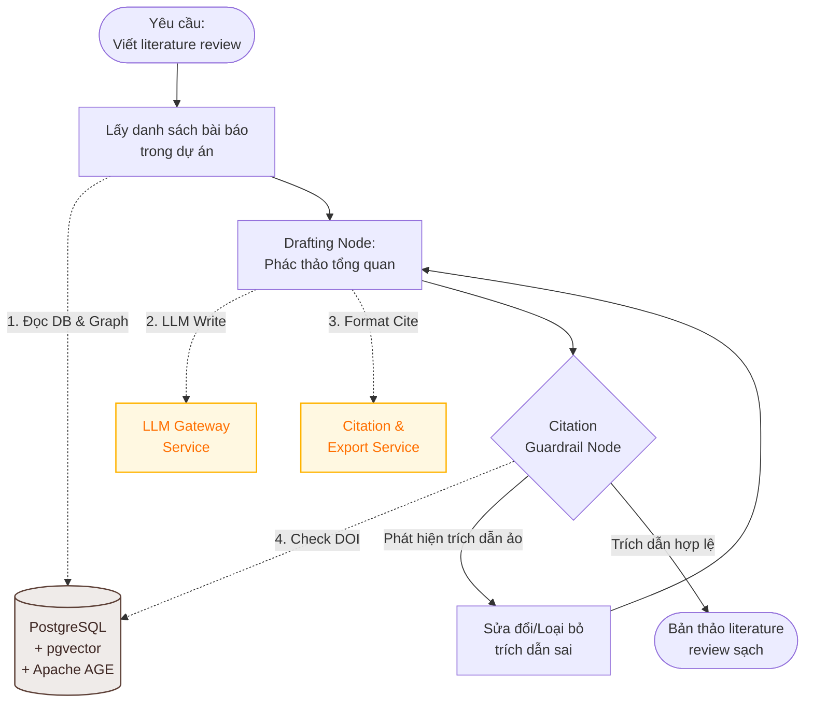
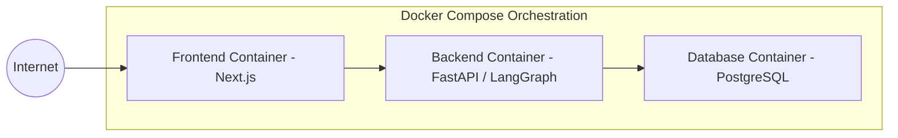

# Architecture Document - AI Trợ Lý Tổng Quan Tài Liệu & Phát Hiện Khoảng Trống Nghiên Cứu (AI20K-031)

## System Overview

Hệ thống **AI Trợ Lý Tổng Quan Tài Liệu & Phát Hiện Khoảng Trống Nghiên Cứu** được thiết kế để giúp các nhà nghiên cứu tự động hóa quy trình tìm kiếm, tổng hợp và đánh giá tài liệu khoa học từ các nguồn uy tín như arXiv và Semantic Scholar. 

Hệ thống sử dụng kiến trúc 3 tầng chuẩn hóa, kết hợp sức mạnh suy luận của AI Agent xây dựng trên nền tảng **LangGraph** cùng cơ chế RAG (Retrieval-Augmented Generation) và cơ sở dữ liệu tri thức tích hợp. Toàn bộ dữ liệu quan hệ, dữ liệu vector (pgvector) và dữ liệu liên kết đồ thị (Apache AGE) được hợp nhất và lưu trữ trong **PostgreSQL** duy nhất, loại bỏ sự phức tạp của việc vận hành nhiều hệ quản trị cơ sở dữ liệu riêng biệt.

---

## Architecture Diagram

---

## Components

### 1. Frontend (React/Next.js)
* **Purpose:** Giao diện người dùng học thuật tương tác thời gian thực.
* **Key Features:**
  * **Dashboard quản lý dự án:** Quản lý dự án theo các chủ đề nghiên cứu khoa học.
  * **Realtime Chat & Streaming Response:** Nhận phản hồi từng token từ AI Agent dạng chat.
  * **Interactive Knowledge Map:** Hiển thị mạng lưới liên kết trích dẫn Cytoscape.js từ dữ liệu Apache AGE.
  * **Document Manager:** Hỗ trợ upload PDF và theo dõi trạng thái xử lý ngầm.
* **State Management:** Zustand / React Context.

### 2. Backend (FastAPI)
* **Purpose:** Trung tâm điều phối business logic, bảo mật, xác thực người dùng và cổng API.
* **API Design:** RESTful API:
  * `/auth/*`: Đăng ký, đăng nhập cấp JWT token lưu trong HttpOnly Cookie.
  * `/projects/*`: CRUD không gian dự án học thuật.
  * `/papers/*`: API tìm kiếm đa nguồn, API trích xuất Graph JSON cho Cytoscape.js từ Apache AGE.
  * `/chat/*`: Endpoint giao tiếp thời gian thực kết nối với AI Agent.
* **Authentication:** JWT (JSON Web Tokens).

### 3. AI Agent (LangGraph)
* **Purpose:** Custom StateGraph (State Machine) phân luồng nghiệp vụ dựa trên Intent Routing.
* **State:** `AgentState` chứa:
  * `messages`: Lịch sử hội thoại.
  * `project_id`: ID dự án hiện tại để phân tách dữ liệu.
  * `retrieved_papers`: Danh sách tài liệu học thuật được RAG truy xuất.
  * `citation_map`: Ánh xạ các câu khẳng định học thuật với bài báo nguồn thực tế.
  * `draft_review`: Văn bản literature review đang phác thảo.
  * `hallucination_score`: Chỉ số đánh giá độ tin cậy của trích dẫn.
* **Nodes:**
  * `router_node`: Định tuyến yêu cầu (Tìm bài báo, phân tích khoảng trống, soạn thảo).
  * `academic_search_node`: Gọi dịch vụ học thuật để tra cứu ngoài.
  * `rag_retrieval_node`: Truy xuất tương đồng ngữ nghĩa từ `pgvector`.
  * `gap_analysis_node`: Phân tích chéo, tìm các mâu thuẫn hoặc hạn chế nghiên cứu.
  * `citation_verify_node` (Guardrail): Đối chiếu, sửa đổi các trích dẫn giả mạo bằng cách tra cứu cơ sở dữ liệu.
  * `drafting_node`: Viết bài tổng quan có trích dẫn chuẩn.
* **Tools:**
  * `arXivSearchTool`: Tra cứu tài liệu arXiv.
  * `SemanticScholarSearchTool`: Lấy siêu dữ liệu học thuật.
  * `PGVectorRetrievalTool`: Tìm kiếm tương đồng vector trong PostgreSQL.
  * `PaperMetadataQueryTool`: Đọc ghi dữ liệu bài báo trong PostgreSQL.
  * `TriggerIngestTool`: Kích hoạt dịch vụ nạp PDF ngầm.

#### Agent Flow Diagram

##### 1. Tìm kiếm học thuật & Tự động tải ngầm (Academic Search & Ingestion)

##### 2. Phân tích so sánh & Khoảng trống nghiên cứu (Literature Gap Analysis)

##### 3. Soạn thảo Literature Review & Kiểm định Trích dẫn (Drafting & Citation Guardrail)

---

### 4. Shared Services Layer (Các dịch vụ dùng chung)
* **Purpose:** Xử lý các tác vụ nền, kết nối API ngoài, phân tích PDF và xây dựng đồ thị tri thức.
* **Key Services & Functions:**
  * **PDF Ingestion Service (Dịch vụ Nạp & Phân tích PDF):**
    * **Bước 1: Trích xuất nội dung (PDF Extraction):** Tiếp nhận tệp PDF tài liệu khoa học, trích xuất văn bản thô và siêu dữ liệu (metadata) của bài viết.
    * **Bước 2: Phân đoạn nội dung (Section Segmentation):** Sử dụng các luật heuristics hoặc LLM để phân chia văn bản thành các mục cấu trúc chuẩn: *Abstract (Tóm tắt), Introduction (Đặt vấn đề), Methodology (Phương pháp), Results (Kết quả), Discussion (Thảo luận), References (Tài liệu tham khảo)*.
    * **Bước 3: Tạo Chunk & Vector Embeddings (Semantic Chunking & pgvector):**
      * Chia nhỏ văn bản của từng phần thành các đoạn văn ngắn (chunks, khoảng 500-1000 tokens) nhằm duy trì ngữ cảnh cụ thể của từng mục.
      * Gửi các chunks qua mô hình nhúng (Embedding Model) để tạo vector đại diện.
      * Lưu các đoạn văn và vector tương ứng vào bảng `paper_chunks` trong PostgreSQL hỗ trợ tìm kiếm ngữ nghĩa (`pgvector`).
  * **Knowledge Graph Builder (Dịch vụ Dựng Bản đồ Tri thức - Apache AGE Ingestion):**
    * **Bước 4: Trích xuất thực thể và liên kết (Entity & Relation Extraction):**
      * Phân tích mục *References* của bài báo để lọc ra danh sách các bài viết được trích dẫn (gồm: tiêu đề, nhóm tác giả, năm xuất bản, journal/conference).
      * Xác định các thực thể tác giả của chính bài báo hiện tại.
    * **Bước 5: Ánh xạ cấu trúc Đồ thị (Cypher Graph Mapping):**
      * Sử dụng câu lệnh Cypher (qua extension **Apache AGE** tích hợp trong PostgreSQL) để lưu trữ thông tin thực thể và mối quan hệ trực tiếp vào cơ sở dữ liệu:
        * Tạo node bài báo `(:Paper {title, authors, year, journal, doc_id})` cho bài báo hiện tại và các bài báo được tham chiếu.
        * Tạo node tác giả `(:Author {name})`.
        * Tạo cạnh có hướng `[:CITES]` nối từ node bài báo hiện tại đến các node bài báo được trích dẫn.
        * Tạo cạnh `[:AUTHORED]` nối từ node tác giả đến node bài báo do họ viết.
    * **Bước 6: Tìm kiếm & Phân tích mối liên hệ (Graph Query & Gap Finding):**
      * Chạy các truy vấn Cypher nâng cao trên Apache AGE để tìm các mẫu liên kết phức tạp (ví dụ: các nhóm nghiên cứu cùng trích dẫn một nguồn nền tảng, hoặc các chuỗi nghiên cứu tiếp nối nhau), hỗ trợ đắc lực cho Agent trong việc phát hiện khoảng trống nghiên cứu.
  * **Academic API Connector:** Dịch vụ kết nối và đồng bộ siêu dữ liệu với arXiv API và Semantic Scholar API.
  * **Citation & Export Service:** Hỗ trợ sinh và xuất định dạng trích dẫn chuẩn hóa (APA, MLA, BibTeX).

---

### 5. Database & Knowledge Storage (PostgreSQL)
* **Engine:** PostgreSQL làm cơ sở dữ liệu hợp nhất.
* **Extensions:**
  * `pgvector`: Lưu trữ embeddings vector và thực hiện tương đồng ngữ nghĩa trực tiếp từ SQL.
  * `Apache AGE`: Hỗ trợ lưu trữ đồ thị (Graph Database) và thực hiện các câu truy vấn Cypher để dựng Bản đồ Tri thức của bài báo.
* **Tables/Schemas:**
  * **SQL Tables:** `users` (tài khoản), `projects` (dự án), `papers` (siêu dữ liệu bài báo), `chat_messages` (lịch sử chat).
  * **pgvector Table:** `paper_chunks` (chứa chunk văn bản trích xuất từ PDF và vector embedding).
  * **Apache AGE Graph:** Graph `literature_graph` chứa các node `(:Paper)`, `(:Author)` và quan hệ `[:CITES]`, `[:AUTHORED]`.
* **Migrations:** Alembic.

---

## Data Flow

1. **Yêu cầu:** Người dùng gửi câu hỏi hoặc yêu cầu viết tổng quan tài liệu từ giao diện Frontend kèm theo ID dự án nghiên cứu.
2. **Xác thực & Điều phối:** Backend FastAPI nhận request, xác thực JWT, load lịch sử chat từ cơ sở dữ liệu và chuyển tiếp yêu cầu đến LangGraph Agent Orchestrator.
3. **Phân tích Ý định:** Node `router_node` của Agent phân tích câu hỏi để quyết định luồng đi.
4. **Truy xuất Thông tin:** 
   * Tìm kiếm học thuật từ arXiv/Semantic Scholar thông qua API Connector Service nếu cần bài báo mới ngoài cơ sở dữ liệu.
   * Truy xuất tương đồng từ PostgreSQL thông qua `PGVectorRetrievalTool` để lấy các chi tiết kỹ thuật của các bài báo khoa học đã nạp.
5. **Phân tích & Suy luận:** Agent so sánh các hướng tiếp cận, tổng hợp các phương pháp, trích xuất mâu thuẫn thực nghiệm hoặc khoảng trống khoa học.
6. **Xây dựng câu trả lời & Kiểm chứng (Guardrail):** Node soạn thảo viết văn bản và kèm trích dẫn. Node `citation_verify_node` thực hiện đối chiếu chéo các trích dẫn học thuật với nguồn thực tế trong database để loại bỏ các trích dẫn giả mạo.
7. **Trả kết quả:** Kết quả sau khi được kiểm chứng sạch sẽ được truyền ngược lại Backend và stream thời gian thực (SSE) lên Frontend cho người dùng.

---

## Deployment Architecture

---

## Security

* **Quản lý Secrets:** Toàn bộ API keys (OpenAI, Gemini, v.v.) và thông số bảo mật được quản lý bằng biến môi trường thông qua file `.env` (không bao giờ được commit lên git).
* **Kiểm thực Input:** Validate chặt chẽ dữ liệu đầu vào sử dụng Pydantic ở tầng FastAPI Backend.
* **Bảo mật Cookie/Auth:** JWT token được lưu ở HttpOnly Cookie phía client để ngăn chặn các cuộc tấn công XSS.
* **CORS & Rate Limiting:** Cấu hình CORS chặt chẽ giới hạn domain của Frontend và tích hợp rate limiting trên các API endpoint đắt tiền (gọi LLM) để phòng chống tấn công từ chối dịch vụ (DDoS) hoặc spam tiêu hao tài khoản API.

---

## Design Decisions

| Quyết định | Lựa chọn | Lý do |
|------------|----------|-------|
| **Backend Framework** | FastAPI | Hỗ trợ async tự nhiên rất tốt cho việc stream SSE dữ liệu LLM, validate kiểu dữ liệu mạnh mẽ với Pydantic, và tự sinh tài liệu API (Swagger UI). |
| **Agent Framework** | LangGraph | Khác với các LCEL chain tuyến tính thông thường, LangGraph cho phép xây dựng các agentic loop có điều kiện, hỗ trợ so sánh chéo, lặp lại suy luận và tích hợp guardrails kiểm tra trích dẫn. |
| **Database** | PostgreSQL | Sử dụng PostgreSQL làm cơ sở dữ liệu hợp nhất cho toàn bộ dữ liệu quan hệ, dữ liệu vector (qua extension `pgvector`) và dữ liệu đồ thị (qua extension `Apache AGE`). |
| **Frontend Framework**| Next.js (React) | Tối ưu hóa SEO cho các trang tĩnh (Landing, Docs) nhờ SSR và hỗ trợ xây dựng giao diện tương tác cao (CSR) cho Chat UI và Canvas bản đồ tri thức. |
| **Thư viện Vẽ Graph** | Cytoscape.js | Thư viện JavaScript mã nguồn mở mạnh mẽ nhất để xử lý và hiển thị các đồ thị liên kết mạng lưới lớn, hỗ trợ tương tác thu phóng và tùy biến style đỉnh/cạnh tốt. |
