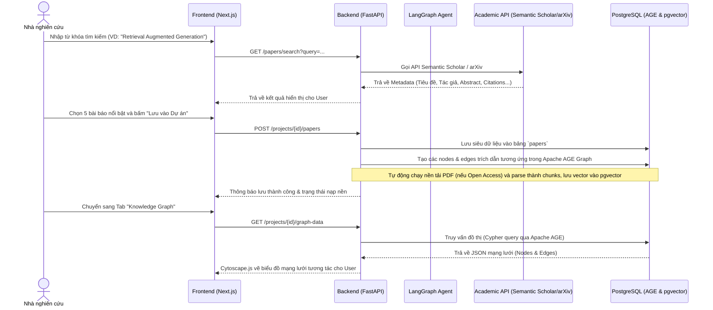
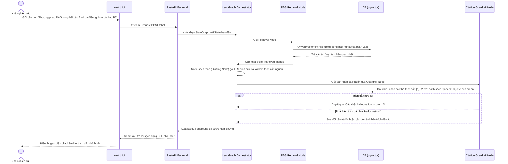
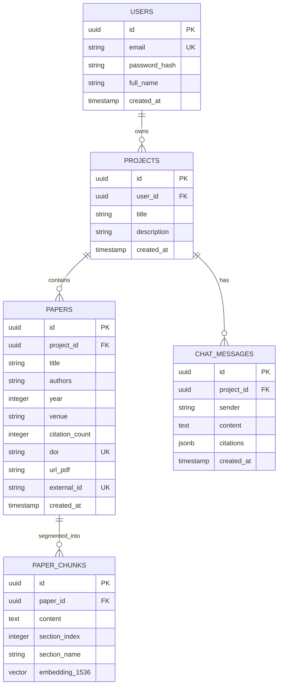

# Tài liệu Yêu cầu Sản phẩm (Product Requirement Document - PRD)
## Dự án: AI Trợ Lý Tổng Quan Tài Liệu & Phát Hiện Khoảng Trống Nghiên Cứu (AI20K-031)

---

## 1. Thông tin chung & Metadata
* **Mã đề tài:** AI20K-031
* **Tên đề tài:** AI Trợ Lý Tổng Quan Tài Liệu & Phát Hiện Khoảng Trống Nghiên Cứu
* **Lĩnh vực:** Nghiên cứu Khoa học (Literature Review / Academic Research)
* **Đối tượng sử dụng:** Sinh viên, Học viên cao học, Nghiên cứu sinh, Giảng viên và Nhà nghiên cứu.
* **Tech Stack định hướng:** Next.js (Frontend), FastAPI (Backend), PostgreSQL + pgvector + Apache AGE (Database), LangGraph (Agentic Framework), Semantic Scholar & arXiv APIs (Academic Data Source).
* **Trạng thái tài liệu:** Draft - Chờ phê duyệt của Giảng viên hướng dẫn.

---

## 2. Bối cảnh & Mục tiêu sản phẩm (Context & Goals)

### 2.1. Bối cảnh bài toán
Trong nghiên cứu khoa học, giai đoạn tổng quan tài liệu (Literature Review) là bắt buộc nhưng cực kỳ tốn thời gian. Nhà nghiên cứu phải đối mặt với các thách thức lớn:
1. **Quá tải thông tin:** Đọc hàng trăm bài báo để tìm ra các công trình thực sự liên quan.
2. **Bỏ sót khoảng trống nghiên cứu:** Rất khó để hệ thống hóa mối quan hệ giữa các nghiên cứu và phát hiện ra điểm mâu thuẫn hay khoảng trống tri thức (research gaps).
3. **Ảo ảnh trích dẫn (Citation Hallucination):** Khi sử dụng các mô hình ngôn ngữ lớn (LLM) thông thường, chúng hay tự "bịa" ra tiêu đề bài báo, tác giả hoặc số DOI không tồn tại.
4. **Quản lý thủ công phức tạp:** Việc theo dõi sơ đồ trích dẫn và xuất định dạng (BibTeX, APA) tốn nhiều công sức.

### 2.2. Mục tiêu sản phẩm
* **Mục tiêu chính:** Xây dựng một ứng dụng Web hoàn chỉnh (deployed online), đóng vai trò trợ lý AI đồng hành cùng nhà nghiên cứu từ khâu tìm kiếm, quản lý tài liệu, vẽ bản đồ tri thức, chat hỏi đáp thông minh cho đến soạn thảo văn bản tổng quan sạch bóng lỗi trích dẫn giả.
* **Mục tiêu định lượng:**
  * Giảm tối thiểu 60% thời gian tìm kiếm và sàng lọc tài liệu cho một chủ đề mới.
  * Đảm bảo **100% trích dẫn thực tế** thông qua lớp lọc Guardrail đối chiếu chéo metadata.
  * Trực quan hóa mối quan hệ trích dẫn bằng biểu đồ mạng lưới tương tác (Interactive Graph Canvas).

---

## 3. Chân dung người dùng (User Personas)

| Hình dung người dùng (Persona) | Nhu cầu chính (Needs) | Nỗi đau (Pain points) | Cách sản phẩm giải quyết |
|---|---|---|---|
| **Nguyễn Văn A**<br/>*(Học viên Cao học)* | Tìm nhanh khoảng 15-20 bài báo uy tín để viết chương Tổng quan của Luận văn Thạc sĩ. | Không biết bài nào là "nền tảng", tốn thời gian đọc lướt hàng chục PDF mà không hiểu cốt lõi. | AI tóm tắt nhanh theo phương pháp/kết quả; Bản đồ Tri thức gợi ý ngay các bài báo có lượng trích dẫn cao nhất (Key Papers). |
| **TS. Trần Thị B**<br/>*(Giảng viên & Nhà nghiên cứu)* | Viết bài báo quốc tế (Q1/Q2), cần tìm các khoảng trống nghiên cứu (Gaps) mới nhất để định vị đóng góp (Contributions) của mình. | Khó phát hiện các mâu thuẫn thực nghiệm giữa các bài báo khác nhau khi chỉ đọc thủ công; Sợ bị bắt lỗi trích dẫn ảo khi dùng AI hỗ trợ viết. | Agent tự động chạy so sánh chéo, tìm các mâu thuẫn thực nghiệm và đề xuất khoảng trống; Citation Guardrail xác thực DOI trước khi xuất bản thảo. |

---

## 4. Phạm vi sản phẩm & Yêu cầu chức năng (Product Scope - MoSCoW)

Sản phẩm được xây dựng để đáp ứng đầy đủ yêu cầu tối thiểu của nhà trường (phải chạy online, có quản lý user, giao diện hoàn chỉnh, không chấp nhận notebook/CLI).

```
┌──────────────────────────────────────────────────────────────────┐
│                          MOSCOW MATRIX                           │
├─────────────────────────────────┬────────────────────────────────┤
│            MUST HAVE            │           SHOULD HAVE          │
│ - Đăng nhập/Đăng ký, quản lý    │ - Bản đồ tri thức tương tác    │
│   User & phân quyền.            │   (Cytoscape.js) từ Apache AGE.│
│ - Tạo/Quản lý dự án học thuật.  │ - Citation Guardrail tự động   │
│ - Tìm kiếm arXiv & Semantic     │   quét và đối chiếu DOI.       │
│   Scholar qua API.              │ - Xuất định dạng APA, BibTeX.  │
│ - Nạp PDF (Upload) & Parse/Chunk│ - Trích xuất tự động mục       │
│   văn bản thông minh.           │   References từ PDF để dựng    │
│ - RAG ngữ nghĩa với pgvector.   │   đồ thị trích dẫn.            │
│ - Chat giao tiếp streaming.     │                                │
├─────────────────────────────────┼────────────────────────────────┤
│           COULD HAVE            │           WON'T HAVE           │
│ - Tự động tải PDF Open Access.  │ - Tải các bài báo trả phí qua  │
│ - Lịch sử chat lưu tự động.     │   tài khoản thư viện (Sci-Hub).│
│ - Nhãn dán phân loại bài báo.   │ - Tự động viết 100% luận văn   │
│                                 │   (AI chỉ hỗ trợ phác thảo).   │
└─────────────────────────────────┴────────────────────────────────┘
```

### 4.1. Nhóm tính năng MUST HAVE (Bắt buộc phải có)
1. **Xác thực và Phân quyền (Auth & User Management):**
   * Cho phép đăng ký, đăng nhập tài khoản.
   * Quản lý phiên đăng nhập an toàn bằng JWT.
   * Phân quyền cơ bản: Nghiên cứu viên (User) và Quản trị viên (Admin).
2. **Quản lý dự án (Project/Workspace Management):**
   * Tạo không gian làm việc riêng cho từng chủ đề nghiên cứu (ví dụ: "Ứng dụng Graph Neural Network trong Y tế").
   * Lưu trữ danh sách bài báo và lịch sử hội thoại riêng biệt theo từng dự án.
3. **Tìm kiếm & Thu thập học thuật (Academic Search & Metadata Collection):**
   * Nhập từ khóa tìm kiếm và gọi trực tiếp API của **arXiv** và **Semantic Scholar**.
   * Hiển thị danh sách kết quả gồm đầy đủ: Tiêu đề, Tác giả, Năm xuất bản, Tóm tắt, Số lượt trích dẫn, DOI, URL PDF.
   * Lưu các bài báo được chọn vào dự án.
4. **Nạp & Phân tích văn bản (PDF Ingestion & Semantic Chunking):**
   * Cho phép tải lên file PDF của bài báo từ máy tính.
   * Parser tách văn bản của PDF thành các phần có cấu trúc (Abstract, Intro, Method, Result...).
   * Sinh vector embeddings cho các đoạn văn bản (chunks) và lưu vào bảng `paper_chunks` sử dụng `pgvector` trong PostgreSQL.
5. **Chat RAG thông minh (Semantic Q&A Chat):**
   * Người dùng đặt câu hỏi trong dự án ("Phương pháp X trong bài báo Y được triển khai thế nào?").
   * Hệ thống truy xuất các đoạn văn bản liên quan nhất bằng vector search và gửi cho LLM để sinh câu trả lời kèm tham chiếu (citation).
   * Stream câu trả lời thời gian thực (Server-Sent Events - SSE).

### 4.2. Nhóm tính năng SHOULD HAVE (Nên có - Tạo điểm nhấn bài tập lớn)
1. **Bản đồ Tri thức Tương tác (Interactive Knowledge Graph):**
   * Trực quan hóa mạng lưới trích dẫn giữa các bài báo trong dự án dưới dạng đồ thị (Nodes: Bài báo/Tác giả, Edges: Cites/Authored).
   * Cho phép zoom, pan, click vào node để xem nhanh thông tin tóm tắt và danh sách các bài liên quan.
   * Sử dụng thư viện đồ họa Frontend như **Cytoscape.js** kết hợp với backend đồ thị **Apache AGE** tích hợp trong PostgreSQL.
2. **Bộ lọc Chống Bịa Trích Dẫn (Citation Guardrail Node):**
   * Một node kiểm định trong LangGraph. Khi LLM soạn thảo câu trả lời hoặc viết literature review, node này sẽ trích xuất tất cả các tài liệu được dẫn chiếu.
   * So khớp tiêu đề, tác giả, DOI với cơ sở dữ liệu thực tế đã lưu trong hệ thống.
   * Nếu phát hiện trích dẫn "ảo", hệ thống sẽ tự động sửa đổi hoặc gắn cờ cảnh báo người dùng.
3. **Quản lý & Xuất trích dẫn (Citation Export):**
   * Xuất danh mục tài liệu tham khảo của dự án sang các định dạng chuẩn học thuật: **BibTeX, APA, MLA**.

### 4.3. Nhóm tính năng COULD HAVE & WON'T HAVE (Mở rộng & Ngoài phạm vi)
* **Could Have:** Tự động tải ngầm PDF từ nguồn Open Access; Cho phép người dùng gắn nhãn tùy chỉnh (Tags) cho từng bài viết.
* **Won't Have:** Hệ thống không bypass Paywall (không tích hợp Sci-Hub hoặc tự động mua bài báo tính phí); Không tự động viết toàn bộ tài liệu từ A-Z mà không có sự kiểm duyệt của con người.

---

## 5. Kiến trúc thông tin & UI/UX (Information Architecture & Wireframes)

Giao diện ứng dụng được thiết kế theo hướng chuyên nghiệp, tối giản, trực quan và hỗ trợ tối đa cho trải nghiệm nghiên cứu lâu dài (Chế độ tối/sáng, font chữ đọc sách thoải mái như Inter/Merriweather).

### 5.1. Sơ đồ các trang (Sitemap / Page Map)
```
├── / (Landing Page: Giới thiệu tính năng, hướng dẫn sử dụng)
├── /login & /register (Trang xác thực người dùng)
├── /dashboard (Bảng điều khiển chính: Danh sách dự án, Thống kê cá nhân)
└── /projects/[project_id] (Không gian làm việc chính của Dự án)
    ├── Tab 1: Chat Assistant (Hội thoại AI & Hỏi đáp tài liệu)
    ├── Tab 2: Knowledge Graph (Bản đồ tri thức dạng mạng lưới)
    ├── Tab 3: Document Library (Thư viện PDF, Upload, Trạng thái nạp)
    └── Tab 4: Review Workspace (Trình soạn thảo Literature Review & Xuất trích dẫn)
```

### 5.2. Mô tả màn hình Workspace chính (`/projects/[project_id]`)
Màn hình được thiết kế theo layout 3 cột (3-pane layout) chuẩn dành cho các ứng dụng phân tích dữ liệu chuyên sâu:
* **Cột trái (Sidebar - 20% độ rộng):** Thư viện tài liệu của dự án. Hiển thị danh sách các bài báo đã được nạp, trạng thái xử lý vector (Đang nạp / Đã nạp thành công), nút tải lên PDF thủ công và nút Tìm kiếm thêm bài viết học thuật.
* **Cột giữa (Workspace Panel - 55% độ rộng):** Chứa các Tab linh hoạt:
  * **Tab Chat:** Giao diện hội thoại với AI Agent, hỗ trợ markdown, công thức toán học LaTeX, và các trích dẫn dạng click-to-view (click vào trích dẫn sẽ mở popover hiển thị thông tin bài báo).
  * **Tab Knowledge Map:** Khung Canvas vẽ đồ thị mạng lưới trích dẫn (Cytoscape.js). Người dùng có thể kéo thả các nút bài báo để thấy luồng phát triển của công nghệ.
* **Cột phải (Editor Panel - 25% độ rộng):** Trình soạn thảo văn bản giàu tính năng (Rich-text editor đơn giản) để người dùng vừa chat với AI vừa ghi chép hoặc phác thảo Literature Review. Cuối cột có danh sách tài liệu tham khảo tự động sinh dựa trên các trích dẫn trong văn bản kèm nút **Export BibTeX/APA**.

---

## 6. Luồng trải nghiệm người dùng chính (User Journeys)

### 6.1. Hành trình: Tìm kiếm tài liệu, nạp hệ thống và xây dựng bản đồ tri thức


### 6.2. Hành trình: Hỏi đáp tài liệu có kiểm chứng trích dẫn (Citation Guardrail Chat)


---

## 7. Yêu cầu phi chức năng (Non-Functional Requirements)

### 7.1. Hiệu năng & Trải nghiệm (Performance & UX)
* **Thời gian phản hồi đầu tiên (TTFT - Time to First Token):** Chat API sử dụng SSE streaming phải trả về token đầu tiên dưới **300ms** kể từ khi gửi request.
* **Thời gian tìm kiếm ngữ nghĩa:** Truy vấn RAG tìm kiếm tương đồng trên bảng `paper_chunks` (sử dụng HNSW index của pgvector) phải hoàn thành trong dưới **200ms** với tập dữ liệu 50.000 chunks.
* **Độ mượt đồ thị:** Khung vẽ Cytoscape.js phải render mượt mà (trên 60fps khi tương tác thu phóng, kéo thả) với đồ thị lên đến **300 đỉnh (nodes) và 1000 cạnh (edges)** trên các trình duyệt Chrome, Safari, Firefox thông dụng.

### 7.2. Bảo mật & Xác thực (Security & Privacy)
* **Bảo mật phiên đăng nhập:** JWT token phải được lưu trong **HttpOnly, Secure Cookie** với thuộc tính SameSite để ngăn chặn triệt để tấn công XSS (Cross-Site Scripting) và CSRF (Cross-Site Request Forgery).
* **Mã hóa dữ liệu:** Mật khẩu người dùng trong DB phải được băm bằng thuật toán **bcrypt** (salt rounds = 12).
* **Quản lý khóa (Secrets):** Toàn bộ API keys của OpenAI, Gemini, Semantic Scholar được lưu ở biến môi trường trên máy chủ và quản lý bằng cơ chế Secret Manager của nền tảng Cloud (không lưu cứng trong code).

### 7.3. Triển khai & Vận hành (Deployment & Portability)
* **Môi trường bắt buộc:** Đóng gói toàn bộ ứng dụng bằng **Docker** (sử dụng `docker-compose` quản lý 3 containers: frontend, backend, database).
* **Yêu cầu triển khai online:** 
  * Frontend: Triển khai trên **Vercel** hoặc **Netlify** (kết nối trực tiếp với GitHub CI/CD).
  * Backend: Triển khai trên các dịch vụ chạy Docker Container như **Render, Railway, Fly.io** hoặc **AWS App Runner**.
  * Database: Sử dụng dịch vụ PostgreSQL Cloud hỗ trợ sẵn pgvector và cài đặt được Apache AGE (ví dụ: các nhà cung cấp như Supabase hoặc tự host PostgreSQL + Extensions trên Docker của Railway/Render).

---

## 8. Mô hình dữ liệu quan hệ (Entity Relationship Diagram - ERD)

Dưới đây là thiết kế cấu trúc dữ liệu lưu trong PostgreSQL hợp nhất:



*Lưu ý về Đồ thị (Apache AGE Graph):* Toàn bộ liên kết trích dẫn chéo sẽ được đồng bộ sang đồ thị `literature_graph` với các thực thể node `(:Paper {doi, title})` và các quan hệ `(:Paper)-[:CITES]->(:Paper)`. Điều này giúp việc truy vấn chuỗi trích dẫn (Citation Chain) bằng ngôn ngữ Cypher diễn ra cực kỳ nhanh chóng thay vì đệ quy SQL phức tạp.

---

## 9. Kế hoạch triển khai & Tiêu chí nghiệm thu (Milestones & Acceptance Criteria)

### 9.1. Các cột mốc triển khai (Phased Milestones)
* **Mốc 1 (Tuần 1-2):** Xây dựng khung Frontend (Next.js), Backend (FastAPI). Hoàn thiện phân hệ Đăng ký/Đăng nhập và CRUD dự án. Triển khai cấu trúc Database PostgreSQL với pgvector.
* **Mốc 2 (Tuần 3-4):** Tích hợp Academic APIs (arXiv/Semantic Scholar) để tìm kiếm và lưu siêu dữ liệu bài báo. Viết Ingestion pipeline nạp PDF, chunking và embedding tự động.
* **Mốc 3 (Tuần 5-6):** Xây dựng AI Agent (LangGraph) với RAG Retrieval và Citation Guardrail. Thiết lập API streaming chat.
* **Mốc 4 (Tuần 7-8):** Triển khai Apache AGE để lưu đồ thị trích dẫn, xây dựng giao diện Bản đồ Tri thức (Cytoscape.js). Kiểm thử tự động và thủ công.
* **Mốc 5 (Tuần 9):** Triển khai sản phẩm lên môi trường Online (Production), chạy thử nghiệm thực tế với nhóm sinh viên và viết báo cáo thuyết trình.

### 9.2. Tiêu chí nghiệm thu (Acceptance Criteria - AC)
1. **AC-1 (Đăng nhập & Bảo mật):** User không thể truy cập vào `/projects/[id]` nếu chưa đăng nhập. JWT token phải biến mất khi bấm "Đăng xuất" và cookie phải được xóa hoàn toàn.
2. **AC-2 (Chống trích dẫn giả):** Khi AI trả lời câu hỏi, mọi trích dẫn dạng số [1], [2] hiển thị trên giao diện chat bắt buộc phải liên kết với một bài báo thực tế trong cơ sở dữ liệu. Nếu trích dẫn không được xác thực, hệ thống phải tự động loại bỏ câu khẳng định đó hoặc thay thế bằng thông báo "không tìm thấy nguồn tin cậy".
3. **AC-3 (Deployed & Live):** Hệ thống có link URL truy cập công khai qua giao thức HTTPS. Mọi chức năng từ Đăng nhập, Tìm kiếm, Chat RAG và Xem bản đồ tri thức hoạt động trơn tru trực tuyến (không bị lỗi CORS giữa Frontend và Backend).
4. **AC-4 (Không bị rò rỉ API Key):** Khi kiểm tra mã nguồn (GitHub repository công khai), không được xuất hiện bất kỳ chuỗi API Key hay thông tin tài khoản Database nào dưới dạng raw text. Tất cả phải được truyền qua file cấu hình môi trường `.env`.
