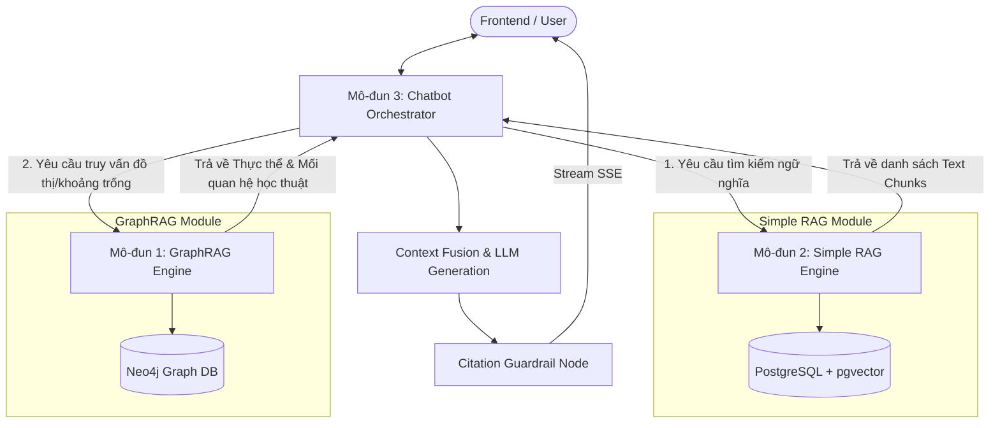
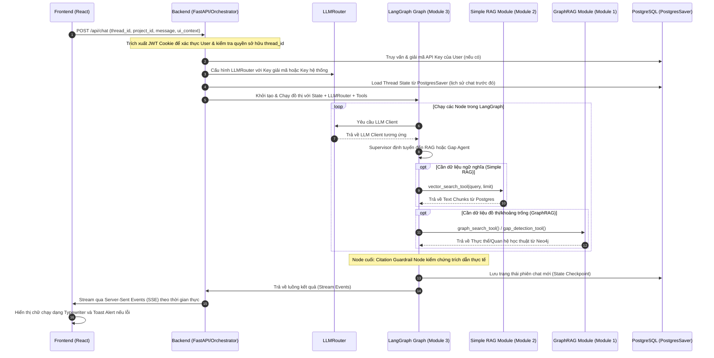

# Architecture Decision Document

## 1. Project Context & Strategy

### 1.1. Chiến lược Phasing
- **Phase 1 (MVP):** Triển khai Ontology và cấu hình Neo4j + Postgres kép. Hỗ trợ hiển thị Cytoscape.js, tìm kiếm khoảng trống. Mã hóa API Keys nội bộ bằng AES/Fernet.
- **Phase 2 (Mở rộng):** Bổ sung Node `(Concept)` và cạnh `[:REQUIRES]` để vẽ "Cây Khái Niệm" (Concept Tree View), tích hợp thêm Web Search cho Chatbot. Triển khai KMS quản lý khóa API chính thức. Tích hợp Langfuse (self-hosted) để giám sát và trace luồng LangGraph AI.

### 1.2. Requirements Overview
**Functional Requirements:**
- **Xác thực & Quản trị:** Đăng nhập/Đăng ký qua JWT lưu trong HttpOnly Cookie. Phân quyền Admin cho tài khoản đăng ký đầu tiên. Cấu hình động các tham số giới hạn lưu trong DB.
- **Quản lý Không gian làm việc:** Workspace-centric. Sidebar trái quản lý CRUD dự án. Trạng thái dự án và chatbot đồng bộ tức thời.
- **Tìm kiếm & Tải tài liệu:** Tìm kiếm song song (arXiv + Semantic Scholar), gộp trùng dựa trên DOI/arXiv ID. Hỗ trợ upload tệp thủ công.
- **AI Agent & Phát hiện khoảng trống:** Trợ lý chatbot RAG + Neo4j/Apache AGE. So sánh chéo bài báo phát hiện mâu thuẫn học thuật.
- **Bản đồ Tri thức:** Sơ đồ tương tác Cytoscape.js vẽ mạng lưới trích dẫn và tác giả.
- **Hỗ trợ viết:** Soạn thảo literature review, quản lý nhiều phiên bản, xuất file ZIP.

**Scale & Complexity:** Hệ thống có độ phức tạp trung bình - cao do tích hợp nhiều công nghệ dữ liệu, xử lý bất đồng bộ, luồng suy luận AI Agent trên LangGraph có tự sửa lỗi trích dẫn.

### 1.3. Infrastructure Constraints
- **Môi trường triển khai:** Chạy Docker Compose trên Single VM **32GB RAM, 6 vcores**. Phục vụ tối đa **10 người dùng đồng thời**. Dung lượng tối đa 20MB/tệp tải lên. Quản trị viên giám sát tải để nâng cấp lên 48GB hoặc 64GB RAM khi mở rộng.
  * *Quản lý Tài nguyên & Hạn chế OOM:* Cấu hình giới hạn tối ưu (dành lại 6GB cho hệ điều hành/Docker): Neo4j giới hạn ở **8GB** (5GB JVM Heap, 3GB Page Cache) cho Phase 1. Giới hạn Worker Ingestion ở **12GB**. PostgreSQL 3GB, API Backend 2GB, và Redis 1GB. Kích hoạt thêm 16GB SWAP nhưng cấu hình `vm.swappiness=10` trên Host để Linux chỉ dùng đến SWAP khi thực sự cạn kiệt, bảo vệ IOPS của Database.
- **Hiệu năng Database:** RAG latency < 500ms cho DB dưới 100,000 vector. 
- **Cơ chế Dọn dẹp (Garbage Collection):** Xóa mềm khi người dùng xóa dự án. Hệ thống ghi sự kiện xóa mềm (Soft-Delete) vào bảng `sync_outbox` để Neo4j cập nhật nhãn `(:Deleted)` cho tài liệu. RAG Queries luôn chứa `WHERE NOT p:Deleted`. Cronjob định kỳ chạy vào 2h sáng để quét và xóa vĩnh viễn (xóa cứng) dữ liệu đã xóa mềm quá 7 ngày ở cả Postgres và Neo4j.

### 1.4. Cross-Cutting Concerns
- **Giao thức & Truyền thông:** REST API cho các tác vụ CRUD thông thường. Stream tiến trình nạp tài liệu và câu trả lời RAG qua Server-Sent Events (SSE). Để tối ưu hóa trải nghiệm, SSE stream các sự kiện tiến trình/luồng suy nghĩ dạng cấu trúc của Agent (`node_start`, `node_end`). Timeout tối đa 10s cho các kết nối HTTP bên ngoài.
  * **Bảo mật SSE (Ticket-based Auth):** Do EventSource không hỗ trợ Header và dễ dính CSRF qua Cookie, Frontend phải gọi `POST /api/sse/ticket` (có kiểm chứng CSRF Token/Cookie) để lấy `ticket` một lần. Sau đó kết nối SSE qua `GET /api/sse/stream?ticket=<ticket>`.
- **Đồng bộ Trạng thái Client (State Sync) & Bù sự kiện (Event Catch-up):** Cập nhật tiến trình nạp vào bảng `papers`. Để giải quyết sự cố mất trạng thái khi F5 trình duyệt, SSE sử dụng chuẩn `Last-Event-ID`. Mỗi event có ID đơn điệu tăng dần. Khi reconnect, Backend đọc ID và `yield` lại các sự kiện bị nhỡ trước khi stream tiếp, đảm bảo UI khôi phục hoàn hảo.
- **API Limits & Cơ chế Retry:** Chịu ảnh hưởng bởi rate limit của arXiv/Semantic Scholar và Gemini API. Các tác vụ gọi API bên ngoài được bọc trong bộ điều phối `tenacity` với Exponential Backoff Retry.
- **Định tuyến LLM (LLMRouter Pattern):** Phân phối API Keys riêng biệt cho từng Agent, giúp cô lập lỗi chạm hạn mức (HTTP 429), không ảnh hưởng luồng giao tiếp chat realtime.
- **Tính toàn vẹn trích dẫn (Citation Integrity):** 100% trích dẫn do LLM sinh ra phải được đối chiếu thực tế tới đoạn văn bản gốc trong DB thông qua Citation Guardrail Node.
- **Tải dữ liệu đồ thị (Lazy Rendering):** API áp dụng cơ chế phân trang và tải động đồ thị (Lazy Rendering) giới hạn số lượng Node/Edge hiển thị để tránh quá tải trình duyệt và Cytoscape.js (chi tiết tại Mục 8.4).

---

## 2. Technology Stack & Modular Separation

### 2.1. Selected Stack
- **Primary Domain:** Web Application.
- **Selected Stack:** FastAPI (Backend) + React 19/Vite 8/TypeScript 6 (Frontend).
  - *Frontend Routing & State:* Sử dụng Zustand v5.0.14 gọn nhẹ để đồng bộ hóa trạng thái giữa các component UI (tab đang chọn, danh sách workspace, lịch sử chat) và React Router v7.17.0.
- **Rationale:** Tận dụng pre-initialized workspace đã có sẵn LangChain và LangGraph, tối ưu hiệu năng tải tệp và xử lý kết nối SSE thời gian thực. Bỏ qua các phương án Full-stack Next.js kết hợp Python chạy riêng rẽ để giảm thiểu độ phức tạp vận hành.

### 2.2. Phân Tách Mô-đun (Modular Separation)
Hệ thống được thiết kế phân tách rõ ràng thành 3 mô-đun độc lập để đảm bảo khả năng bảo trì, mở rộng và tối ưu hóa hiệu năng riêng biệt. Không gộp chung mã nguồn và logic của hai công cụ tìm kiếm với nhau.



---

## 3. Core Architectural Decisions & Priorities

### 3.1. Implementation Roadmap
- **Trình tự triển khai đề xuất:**
  1. Cấu hình Docker Compose chạy cơ sở dữ liệu Postgres + Neo4j.
  2. Triển khai cơ chế Xác thực & Bảo mật (JWT cookie, RBAC, encryption).
  3. Xây dựng cấu trúc Backend FastAPI, tích hợp SQLAlchemy và thiết lập Alembic.
  4. Viết module Auth và quản lý Workspace.
  5. Triển khai hai giai đoạn nạp tài liệu (Docling + Gemini extraction) và Eventual Consistency worker.
  6. Xây dựng đồ thị Agent LangGraph với PostgresSaver checkpointer.
  7. Phát triển Frontend React kết nối các API thông qua Zustand.

---

## 4. Authentication & Security (Xác thực & Bảo mật)

- **Công nghệ sử dụng:** Bcrypt cho mật khẩu, PyJWT (thuật toán HS256) cho token và FastAPI Dependencies để kiểm tra quyền hạn.
- **Cấu trúc bảng Database (`users`):**
  ```sql
  CREATE TABLE users (
      id UUID PRIMARY KEY DEFAULT gen_random_uuid(),
      email VARCHAR(255) UNIQUE NOT NULL,
      hashed_password VARCHAR(255) NOT NULL,
      role VARCHAR(50) NOT NULL DEFAULT 'user', -- 'admin' hoặc 'user'
      is_active BOOLEAN NOT NULL DEFAULT TRUE,
      created_at TIMESTAMP WITH TIME ZONE DEFAULT CURRENT_TIMESTAMP,
      updated_at TIMESTAMP WITH TIME ZONE DEFAULT CURRENT_TIMESTAMP
  );
  CREATE INDEX idx_users_email ON users(email);
  ```
- **Cơ chế xác thực:** JWT tùy biến lưu trong HttpOnly, SameSite=Lax cookie để giảm thiểu rủi ro XSS. Tên cookie: `access_token` (Thời hạn 24 giờ). Để phục vụ môi trường phát triển local (Vite chạy ở `localhost:5173` và FastAPI chạy ở `localhost:8000`), cấu hình Vite dev server proxy để chuyển tiếp các request `/api` về FastAPI backend, giải quyết triệt để rào cản CORS đối với cookie HttpOnly mà không cần hạ cấp bảo mật SameSite.
- **Phân quyền (Authorization):** Phân quyền dựa trên vai trò (RBAC), tài khoản đăng ký đầu tiên tự động nhận quyền Admin.
- **Bảo mật Tài nguyên Tĩnh (Secure Media Access):** Tránh phục vụ công khai hình ảnh/biểu đồ qua URL tĩnh. Thay vào đó, xây dựng endpoint bảo mật `GET /api/projects/{project_id}/images/{image_name}`. API này thực hiện xác thực JWT cookie và kiểm tra quyền sở hữu đối với dự án (`project_id`) trước khi trả về hình ảnh bằng `FileResponse` từ thư mục bảo mật `/app/data/images/`.
- **Bảo mật API Key:** Sử dụng thư viện `cryptography` để mã hóa AES/Fernet các API Keys của người dùng lưu trữ trong PostgreSQL.

---

## 5. Data Architecture & Graph Ontology

Hệ thống sử dụng mô hình Cơ sở dữ liệu Kép (Dual-Database Model) phân tách trách nhiệm rõ ràng:

### 5.1. PostgreSQL + pgvector (Lưu trữ Metadata, Vector & RAG)
Xử lý lưu trữ quan hệ và tìm kiếm nhúng vector (với chỉ mục HNSW trên cột `embedding`). Để tránh penalty khi ghi hàng loạt vector, hệ thống có thể tăng `maintenance_work_mem` hoặc rebuild index sau batch.
* **ORM & Migration:** SQLAlchemy (async) v2.0.50 + Alembic v1.18.4 để quản lý schema migration tự động.
* **Bảng `projects`, `papers`, `settings`**: Lưu metadata dự án, tài liệu và cấu hình hệ thống động.
* **Bảng `parent_chunks`, `child_chunks`**: Lưu trữ nội dung văn bản băm nhỏ kèm vector embedding.
* **Bảng `sync_outbox`**: Bảng trung gian lưu tác vụ đồng bộ đồ thị.
* **Mô-đun 2 (Simple RAG Engine) API cung cấp:**
  * `vector_search(query: str, limit: int, project_id: UUID) -> List[ChildChunk]`: Thực hiện tìm kiếm cosine similarity trên bảng `child_chunks` (nhắm tới cột `embedding`), trả về các phân đoạn văn bản và tham chiếu `parent_chunk_id`.

### 5.2. Neo4j (Knowledge Graph & Ontology)
Lưu trữ cấu trúc đồ thị phục vụ phát hiện khoảng trống nghiên cứu và hiển thị Cytoscape.js. Tích hợp thuật toán lai Hybrid GraphRAG (Microsoft GraphRAG Communities + LightRAG Dual-Level Retrieval).
* **Phân bổ RAM tối ưu (Phase 1 trên VM 32GB):** Cấp **8GB** (5GB JVM Heap + 3GB Page Cache).
* **Entity Resolution (Hợp nhất tác giả):** Chuẩn hóa chuỗi tên (bỏ khoảng trắng thừa, viết thường). Thực hiện thuật toán đối sánh tác giả: Gộp node Author nếu tên trùng khớp hoàn toàn VÀ thỏa mãn nhất ít nhất một trong hai tiêu chí: (1) Chỉ số Jaccard Similarity của danh sách đồng tác giả (co-authors) giữa hai tài liệu đạt $\ge 0.3$, hoặc (2) Độ tương đồng Cosine Similarity của vector nhúng chủ đề nghiên cứu (TF-IDF trên abstracts/topics của hai bài báo) đạt $\ge 0.5$. Để giảm thiểu sai sót đối với các tên tác giả phổ biến trùng nhau, hệ thống sử dụng thêm trường thông tin định danh bổ sung (như ORCID ID hoặc email/tổ chức nếu có từ API của Semantic Scholar) làm điều kiện ưu tiên trước khi áp dụng heuristic độ tương đồng. Nếu không thỏa mãn, tạo node Author độc lập để tránh gộp nhầm người trùng tên.
* **Graph Schema (Phase 1):**
  * **Nodes:** `Paper`, `Author`, `Topic`, `Method`, `Dataset`, `Limitation`, `Problem`, `Community`.
    * `Finding`: `{id, description, confidence_score: Float}` (Điểm do LLM đánh giá 0.0-1.0).
  * **Edges:** `[:AUTHORED_BY]`, `[:CITES]`, `[:HAS_FINDING]`, v.v.
    * *Tương tác học thuật:* `(:Finding)-[:CONTRADICTS]->(:Finding)`, `(:Finding)-[:SUPPORTS]->(:Finding)`, `(:Paper)-[:HAS_LIMITATION]->(:Limitation)`, `(:Paper)-[:FILLS_GAP]->(:Limitation)`.
* **Đánh chỉ mục Cộng đồng (Graph Indexing):** Sử dụng thuật toán Leiden để nhóm các Nodes thành Communities. Chạy ngầm qua Background Worker (Cron/Arq) sau khi nạp tài liệu. Các cộng đồng này được `gemini-1.5-flash` tóm tắt (Hierarchical Community Summaries) và lưu ngược lại Neo4j.
* **Mô-đun 1 (GraphRAG Engine) API cung cấp:**
  * `graph_search(entities: List[str], project_id: UUID) -> GraphContext`: Truy vấn đồ thị xung quanh các thực thể khóa để lấy quan hệ ngữ cảnh.
  * `gap_detection(project_id: UUID) -> GapContext`: Phân tích đồ thị tìm đường đi để xác định các khoảng trống học thuật.
  * `community_summary_search(query: str, project_id: UUID) -> List[str]`: Tìm kiếm trên các tóm tắt phân cấp của cộng đồng (GraphRAG Communities).

### 5.3. Tính nhất quán CSDL (Eventual Consistency & Sync Manager)
Đảm bảo đồng bộ dữ liệu an toàn từ Postgres sang Neo4j:
* Khi Postgres thay đổi dữ liệu, một sự kiện được ghi transactionally vào bảng `sync_outbox`.
* Background Worker chạy ngầm quét bảng `sync_outbox` theo lô (batch). Để tránh tranh chấp tài nguyên khi chạy đa tiến trình worker, sử dụng cơ chế khóa hàng `SELECT ... FOR UPDATE SKIP LOCKED` của Postgres.
* Đảm bảo thứ tự đồng bộ (Order Guarantee) bằng cách lấy khóa phân tán (Redis Lock) theo nhóm `project_id`. Khóa có lease timeout ngắn (ví dụ 2 phút). Để tránh Deadlock khi batch Neo4j chạy quá lâu, worker triển khai **Cơ chế Lock Heartbeat**: Một luồng nền chạy song song cứ mỗi phút lại gọi Redis để gia hạn (extend) thời gian sống của khóa.
* Định nghĩa cơ chế xử lý lỗi đồng bộ: Khi một tác vụ đồng bộ thất bại quá số lần thử cấu hình (ví dụ: 3 lần), sự kiện trong `sync_outbox` sẽ được đẩy vào hàng đợi lỗi (Dead-Letter Queue - DLQ) để xử lý thủ công, tránh nghẽn tiến trình của dự án.
* Phía Neo4j sử dụng các câu lệnh Cypher với mệnh đề `MERGE` và thiết lập các ràng buộc duy nhất (Unique Constraints) trên định danh Node ID để đảm bảo tính tuần tự và khả năng ghi đè trùng lặp (Idempotent Upsert).

---

## 6. Ingestion & RAG Strategy

### 6.1. Nạp tài liệu bất đồng bộ & Quản lý Tài nguyên
* **Kiến trúc Worker riêng biệt:** Sử dụng queue worker bất đồng bộ chuyên dụng (`arq`). Đặt giới hạn `concurrency_limit` = 2 và cấu hình biến môi trường `OMP_NUM_THREADS=1`, `OPENBLAS_NUM_THREADS=1` để chống nghẽn CPU Thread Thrashing cho các thư viện Deep Learning.
* **Kiểm đếm Concurrency trên Postgres:** Khống chế giới hạn nạp toàn hệ thống và cá nhân qua `MAX_CONCURRENT_PER_USER` để tránh sập hệ thống.

### 6.2. Two-Stage Ingestion Pipeline & Dynamic Routing
* **Raw Parsing (Định tuyến theo MimeType):**
  * **File DOCX:** Chuyển đổi siêu tốc sang Markdown bằng `mammoth` hoặc `python-docx` (0% tải CPU).
  * **File PDF:** Dùng `PyMuPDF` quét text trước. Chỉ khi có trang chứa Bảng biểu/Công thức phức tạp mới kích hoạt `Docling (IBM)` chạy cục bộ để trích xuất HTML Tables và crop ảnh. Xuất ra Raw Markdown.
* **Giai đoạn 1: Semantic Structuring (`gemini-2.5-flash`)**
  * Đưa Markdown thô vào mô hình nhanh, rẻ với Context Window khổng lồ.
  * *Nhiệm vụ:* Trích xuất **JSON Metadata** (Title, Authors, Abstract), làm sạch format bảng biểu, và tối quan trọng: **Chủ động suy luận và chèn các thẻ Heading Markdown (`#`, `##`, `###`)** vào những dòng được định dạng in đậm để khôi phục Cấu trúc Phân cấp (giúp cắt Chunk chính xác).
* **Giai đoạn 2: Graph Extraction (`gemini-2.5-pro`)**
  * Đưa văn bản Markdown đã được "làm sạch và cấu trúc hóa" (từ GĐ 1) cùng với Metadata vào mô hình Pro.
  * *Nhiệm vụ duy nhất:* Suy luận logic chuyên sâu để bóc tách Thực thể (Nodes) và Quan hệ học thuật (Edges). Điều này loại bỏ hoàn toàn việc quá tải LLM, tránh lỗi cắt cụt JSON hay Hallucination.
* **Xử lý lỗi LLM:** Việc tách bạch giúp độc lập Retry từng khâu nếu vướng Rate Limit, không tốn lại chi phí Token của bước cũ.

### 6.3. Chunking & Global-Local Context
* **Cơ chế Chunking phân cấp (Parent-Child Chunking Strategy):**
  * **Parent Chunks:** Cắt tài liệu dựa trên ranh giới các thẻ Heading được chuẩn hóa ở Giai đoạn 2. Mỗi Parent Chunk đại diện cho một chủ đề logic hoàn chỉnh (kích thước động từ 1,000 đến 3,000 ký tự). Được lưu vào bảng `parent_chunks` để làm ngữ cảnh đầy đủ khi trả về kết quả.
  * **Child Chunks:** Chia nhỏ mỗi Parent Chunk bằng phương pháp cửa sổ trượt (sliding window) để tạo ra các node dày đặc phục vụ tìm kiếm vector:
    * **Kích thước Child Chunk:** Cố định **500 ký tự** (khoảng 100-120 từ).
    * **Độ trùng lặp (Overlap):** Cố định **100 ký tự** (khoảng 20-25 từ) giữa các chunk kề nhau để bảo toàn tính liền mạch của câu chữ.
    * **Liên kết:** Mỗi Child Chunk được tạo ra sẽ lưu kèm khóa ngoại `parent_chunk_id` trỏ về Parent Chunk chứa nó. Vector nhúng (Embedding) được tạo bằng model `text-embedding-004` trên nội dung của Child Chunk.
* **Khử trùng lặp (Deduplicate) & Global Context:** Dùng SQL JOIN để không nạp trùng lặp Parent Chunk. Tóm tắt (Abstract) được chèn làm Global Context ở đầu Prompt để tránh hiệu ứng "Lost in the middle".

### 6.4. Hoạt động của Citation Guardrail Node
Trong LangGraph, Node kiểm chứng trích dẫn tự động bảo vệ tính chính xác:
1. Trích xuất thẻ tham chiếu từ văn bản sinh ra bởi LLM.
2. Kiểm tra ánh xạ tới danh sách tài liệu RAG Context.
3. **Deterministic Post-Processing (Xử lý hậu kỳ bằng Code Python thuần):** Để triệt tiêu hoàn toàn Latency phát sinh từ việc gọi lại LLM (vốn thường xuyên dẫn đến sai sót lặp lại do Hallucination), hệ thống sử dụng Regex ánh xạ ngay lập tức các ID trích dẫn với mảng Chunk thực tế.
4. Nếu LLM sinh ra trích dẫn ảo (ví dụ `[9]` nhưng chỉ có 5 chunks), Script Python lập tức thay thế thẻ ảo thành `[Nguồn không xác định]` hoặc gỡ bỏ hoàn toàn trước khi stream tiếp về Frontend. Đảm bảo tốc độ RAG duy trì dưới 500ms và không tốn thêm token lãng phí.

---

## 7. AI Agent LangGraph & Chatbot Orchestrator (Mô-đun 3)

Đầu mối giao tiếp chính là **Mô-đun 3: Chatbot Orchestrator** được điều phối qua LangGraph. Khi nhận đầu vào từ Frontend, module này gọi song song/tuần tự đến **Simple RAG Module** và **GraphRAG Module** để thu thập dữ liệu nguồn, thực hiện gộp (fusion), tạo câu trả lời và kiểm chứng trích dẫn.

### 7.1. Phân vai các Agent (Graph Topology)
Sử dụng mô hình Router-Worker (Orchestrator) gồm 3 Agent chính hoạt động như các Node trong đồ thị LangGraph:
* **Supervisor Agent (Orchestrator):** Sử dụng `gemini-1.5-flash` (hoặc `gemini-2.0-flash`). Nhận tin nhắn và `ui_context` từ người dùng, định tuyến tác vụ đến RAG Agent hoặc Gap Analyst Agent phù hợp, hoặc tự trả lời các câu hỏi giao tiếp thông thường.
* **Research & RAG Agent (Worker):** Sử dụng `gemini-1.5-pro`. Chuyên trách lấy dữ liệu ngữ nghĩa từ **Mô-đun 2: Simple RAG** (thông qua `vector_search_tool`) và dữ liệu mối quan hệ từ **Mô-đun 1: GraphRAG** (thông qua `graph_search_tool`) để trả lời các câu hỏi học thuật và trích xuất nguồn dẫn chứng.
* **Gap Analyst Agent (Worker):** Sử dụng `gemini-1.5-pro`. Chuyên trách phân tích các khoảng trống nghiên cứu bằng cách gọi **Mô-đun 1: GraphRAG** (thông qua `gap_detection_tool`) để xác định mâu thuẫn học thuật (`CONTRADICTS`), hạn chế (`Limitation`) và cơ hội nghiên cứu mới.

### 7.2. Danh sách các Công cụ (Tools Definition)
Các Worker Agents tương tác với các mô-đun nguồn độc lập thông qua các công cụ (Tools) sau để tránh truy cập trực tiếp vào DB thô:
1. `vector_search_tool(query, limit, project_id)`: Gọi API `vector_search` của **Mô-đun 2** để lấy các đoạn văn bản tương đồng ngữ nghĩa.
2. `graph_search_tool(query, project_id)`: Gọi API `graph_search` của **Mô-đun 1** để truy vấn các mối quan hệ thực thể xung quanh từ khóa.
3. `gap_detection_tool(project_id)`: Gọi API `gap_detection` của **Mô-đun 1** để lấy danh sách mâu thuẫn học thuật và hạn chế tài liệu phục vụ phân tích.
4. `citation_retrieval_tool(paper_ids)`: Gọi API của **Mô-đun 2** để truy vấn metadata chi tiết của tài liệu từ Postgres.
5. `workspace_context_tool()`: Đọc thông tin các tài liệu hiện có trong dự án và trạng thái UI (`ui_context`) gửi kèm từ Frontend.

### 7.3. Cơ chế tương tác với LLMRouter
Mọi cuộc gọi LLM trong các Node của LangGraph đều đi qua `LLMRouter`:
* LangGraph Node yêu cầu khởi tạo Client LLM kèm `user_id` thông qua Context của Graph.
* `LLMRouter` truy vấn PostgreSQL để lấy API Key riêng của User (giải mã AES/Fernet) hoặc tự động fallback sang System API Key (của Admin).
* Hạn mức (Rate limit) được cách ly độc lập trên từng API Key, tránh ảnh hưởng chéo giữa các phiên chat của người dùng.

### 7.4. Luồng Xử Lý 4 Bước của Chatbot Orchestrator
1. **Bước 1: Phân tích Truy vấn & Gọi Module Nguồn:** Chatbot phân tích câu hỏi thành thực thể và sub-queries. Gọi đồng thời `vector_search` từ **Simple RAG** và `graph_search` / `gap_detection` từ **GraphRAG**.
2. **Bước 2: Gộp và Sắp xếp Ngữ cảnh (Context Fusion & Rerank):** Nhận danh sách Text Chunks và Đồ thị Tri thức, tiến hành fusion để gộp các chunk tương ứng với các node quan trọng nhất. Giới hạn ngữ cảnh ở mức **8,000 tokens** để tránh trễ hoặc quá tải.
3. **Bước 3: Gọi LLM tạo câu trả lời (Generation):** Synthesize prompt bằng cách chèn cả Global Context (Abstract) và Local Fused Context, yêu cầu LLM sinh câu trả lời kèm thẻ trích dẫn dạng `[1]`, `[2]`.
4. **Bước 4: Kiểm chứng Trích dẫn & Tiến trình Trực quan:** Chạy qua Citation Guardrail Node để đối chiếu các thẻ trích dẫn với dữ liệu thực tế từ **Simple RAG Module**, sửa đổi thẻ lỗi và stream kết quả về Frontend qua SSE. Hệ thống stream thêm các sự kiện tiến trình/luồng suy nghĩ dạng cấu trúc (chẳng hạn: `{"event": "agent_thinking", "status": "retrieving_rag_context"}`) trước khi bắt đầu stream văn bản để giảm thiểu cảm giác chờ đợi do độ trễ đa Agent trong LangGraph.

### 7.5. Luồng tương tác Hệ thống (System Sequence Flow)
Luồng tương tác giữa Frontend (React), Backend (FastAPI), LangGraph và hai mô-đun nguồn được mô tả qua sơ đồ sau:



### 7.6. Cấu trúc Prompt Context chuẩn hóa gửi lên LLM
```
Bạn là một Trợ lý Nghiên cứu Khoa học chuyên nghiệp. Hãy trả lời câu hỏi của người dùng dựa trên Ngữ cảnh được cung cấp dưới đây. 
Yêu cầu bắt buộc: Mỗi thông tin đưa ra phải được trích dẫn trực tiếp từ tài liệu tương ứng bằng cách chèn thẻ [Số thứ tự] ở cuối câu (ví dụ: [1], [2]).

---
BẮT ĐẦU NGỮ CẢNH HỆ THỐNG:
[Tóm tắt dự án & Tài liệu chính (Global Context)]
Tài liệu [1]: Title: "...", Author: "...", Abstract: "..."
Tài liệu [2]: Title: "...", Author: "...", Abstract: "..."

[Ngữ cảnh chi tiết (Local Fused Context)]
Nguồn [1]: "Nội dung đoạn văn bản 1..."
Nguồn [2]: "Nội dung đoạn văn bản 2..."

[Quan hệ Đồ thị tri thức (Graph Context)]
- Phương pháp A hỗ trợ giải quyết vấn đề B (được chứng minh trong tài liệu [1]).
- Thực nghiệm của tài liệu [2] mâu thuẫn với kết quả của tài liệu [1].
KẾT THÚC NGỮ CẢNH HỆ THỐNG.
---

Câu hỏi của người dùng: {user_message}
Câu trả lời của bạn:
```

---

## 8. System Components & API Integration

### 8.1. Quản lý Lịch sử Chat (Chat Session Management)
Để hỗ trợ tính năng xem lại lịch sử trò chuyện (Chat History Popover) trong dự án, hệ thống sử dụng **PostgresSaver** làm Checkpointer cho LangGraph.
* **Bảng lưu trữ:** Thiết kế bảng `threads` và `messages` trên PostgreSQL để lưu trữ trạng thái (State) của từng phiên chat được nhóm theo `project_id`.
* Khi người dùng click chọn một phiên chat cũ, Frontend gọi API để tải lại toàn bộ Thread State từ PostgresSaver, cho phép AI Agent tiếp nối trơn tru ngữ cảnh của phiên làm việc đó.
* **Dọn dẹp Checkpoint cũ (Checkpoint Pruning):** Để tránh phình to dữ liệu (DB bloat) do lưu trữ toàn bộ trạng thái LangGraph sau mỗi bước chạy, thiết lập một cronjob định kỳ hàng đêm (ví dụ: 3h sáng) chạy script quét bảng checkpointer để chỉ giữ lại tối đa $N$ checkpoints gần nhất (mặc định $N = 50$) cho các phiên chat đang hoạt động nhằm bảo vệ tính toàn vẹn của lịch sử LangGraph, tránh làm gián đoạn trạng thái khi chạy nhiều bước phức tạp.

### 8.2. Chuyền Ngữ Cảnh Giao Diện (Context-Aware User Guiding)
Chatbot đóng vai trò trợ lý chủ động và cần biết trạng thái UI của người dùng để gợi ý các nút bấm động (Dynamic Quick Reply Buttons).
* **Payload API Chat:** Khi gửi tin nhắn (qua API REST hoặc WebSocket), Frontend cần gửi kèm object `ui_context`:
  ```json
  {
    "active_tab": "document_library",
    "document_count": 0,
    "has_draft": false
  }
  ```
* **Xử lý tại LLM:** LangGraph nhận `ui_context` này để nhúng vào System Prompt. Tùy thuộc vào ngữ cảnh, LLM sẽ tự động phân tích và sinh ra danh sách `suggested_actions` để Frontend hiển thị thành các thẻ nút bấm điều hướng.

### 8.3. Xử Lý Trích Dẫn & Xuất Báo Cáo (Citation & Export Capabilities)
Đảm bảo tính năng xem nguồn trích dẫn và xuất file kết quả nghiên cứu:
* **Citation Tooltip API:** Cung cấp endpoint `GET /api/citations/{citation_id}`. Khi người dùng di chuột (hover) hoặc click thẻ `[1]`, Frontend gọi API này để fetch metadata của bài báo kèm theo đoạn văn bản gốc (`text_chunk`) lấy trực tiếp từ bảng `child_chunks`.
* **Export API (Markdown & BibTeX):** Endpoint `GET /api/projects/{project_id}/export`.
  * Backend đọc metadata từ Postgres và sử dụng định dạng chuẩn (hoặc qua thư viện `bibtexparser`) để chuyển đổi thành văn bản file `.bib`.
  * Nén cả file `.md` (bản thảo) và `.bib` bằng module `zipfile` của Python, sau đó trả về dữ liệu qua `StreamingResponse` để người dùng tải xuống tệp `.zip`.

### 8.4. Kiểm Soát Giới Hạn Nghiệp Vụ & Xử Lý Sự Cố (Limits & Fallback)
* **Quản lý Cấu hình Động & Giới hạn của Admin (Admin Settings & Limits):**
  * Các tham số cấu hình hệ thống được lưu trữ động trong bảng `settings` (PostgreSQL) và có thể cập nhật thông qua trang Admin Panel:
    * `MAX_PAPERS_PER_PROJECT` (integer, mặc định: `15`): Giới hạn số tài liệu tối đa của mỗi dự án.
    * `DEFAULT_LLM_MODEL` (string, mặc định: `"gemini-2.5-pro"`): Model mặc định dùng cho các tác vụ xử lý ngôn ngữ/RAG. Giao diện Admin Panel cung cấp danh sách tùy chọn các mô hình với định danh chính thức: `gemini-1.5-pro`, `gemini-1.5-flash`, `gemini-2.0-flash`, `gemini-2.5-pro`, `gemini-2.5-flash`, `gemini-3.1-flash-lite`, và `gemini-3.1-pro-preview` (hoặc `gemini-3.1-pro`).
    * `CHILD_CHUNK_SIZE` (integer, mặc định: `500`): Kích thước ký tự của một Child Chunk.
    * `CHILD_CHUNK_OVERLAP` (integer, mặc định: `100`): Độ trùng lặp ký tự giữa các Child Chunks kề nhau.
    * `PARENT_CHUNK_MAX_SIZE` (integer, mặc định: `3000`): Giới hạn kích thước tối đa của một Parent Chunk.
  * **Chặn Giới hạn Tài liệu & Phòng chống Race Condition (Hard Limit Validation):**
    * Logic chặn ở Gateway/Controller: Để ngăn chặn hành vi tải lên đồng thời nhằm vượt quá giới hạn (Double Submit / TOCTOU) mà không gây deadlock hệ thống, hệ thống sử dụng khóa phân tán dựa trên Redis (Redis distributed locks) hoặc cơ chế kiểm soát phiên bản lạc quan (Optimistic Concurrency Control) with cột `version` trên bảng `projects` để xác thực số lượng tài liệu hiện có trước khi ghi. Tránh sử dụng khóa dòng nặng nề `FOR UPDATE` trên PostgreSQL để ngăn ngừa tắc nghẽn giao dịch khi tải lên đồng thời. Nếu vượt quá giới hạn, transaction lập tức bị rollback và trả về mã lỗi `HTTP 403 Forbidden` để chặn cứng tính năng upload.
* **Cơ chế Fallback Search API (Degraded Union):**
  * Gọi API arXiv và Semantic Scholar song song qua `asyncio.gather`.
  * Thiết lập thời gian timeout ở mức **8.0 giây** (ví dụ: `httpx.AsyncClient(timeout=8.0)`) kèm theo bộ đệm (caching) Redis có thời hạn 24 giờ cho các kết quả tìm kiếm để tránh tình trạng timeout liên tục khi các dịch vụ công cộng bị nghẽn tải.
  * Nếu một luồng văng lỗi `TimeoutException` hoặc HTTP Error, xử lý ngầm và trả về kết quả của nguồn thành công còn lại, kèm theo mảng `warnings: ["semantic_scholar_timeout"]` trong response JSON để Frontend hiển thị Toast Alert màu vàng.
* **Cytoscape.js Lazy Rendering & Layout Expansion:**
  * Ban đầu, API trả về đồ thị giới hạn tối đa 150 nodes và 300 edges kèm cờ `has_more` để tránh quá tải trình duyệt và Cytoscape.js.
  * Để hỗ trợ hiển thị dữ liệu lớn hơn, cung cấp endpoint `GET /api/projects/{project_id}/graph/nodes/{node_id}/expand` trả về các node và cạnh lân cận trong vòng 1-hop của node được chọn (giới hạn 20 thực thể mới). Frontend sử dụng tính năng tải động (incremental load) và áp dụng cơ chế bố cục gia tăng (incremental layout - ví dụ dùng `fcose` layout hoặc `cola`) để thêm node vào Cytoscape viewport mà không làm xáo trộn vị trí của các node cũ đang hiển thị.

### 8.5. Network Exposure & Port Configuration (Xubuntu VM)
Để truy cập ứng dụng từ các thiết bị ngoại vi vào Xubuntu VM trong giai đoạn Development/Phase 1, kiến trúc thiết lập Host Binding và tường lửa (UFW) như sau:
* **Host Binding:** Cấu hình FastAPI (`--host 0.0.0.0`) và Vite (`host: '0.0.0.0'` trong `vite.config.ts`) để lắng nghe trên tất cả các interfaces mạng.
* **Ports Public (Mở qua UFW Firewall `sudo ufw allow <port>/tcp`):**
  * `5173/tcp`: Giao diện Web Application (Frontend Vite).
  * `8000/tcp`: REST API & Server-Sent Events (Backend FastAPI, cũng dùng cho Swagger UI).
  * `7474/tcp`: Neo4j Browser (Tùy chọn Debug đồ thị trực quan cho Dev/Admin).
* **Ports Internal (Tuyệt đối không expose ra public):** `5432` (Postgres), `6379` (Redis), `7687` (Neo4j Bolt) chỉ giao tiếp an toàn qua internal Docker network.

---

## 9. Implementation Guide & Project Structure

### 9.1. Naming Patterns (Quy chuẩn Đặt tên)
**Database Naming Conventions:**
*   **Tables:** Số nhiều, `snake_case` (ví dụ: `users`, `projects`, `papers`).
*   **Columns:** Số ít, `snake_case` (ví dụ: `user_id`, `created_at`, `is_active`).
*   **Foreign Keys:** `<bảng_số_ít>_id` (ví dụ: tham chiếu bảng `users` thì cột là `user_id`).

**API Naming Conventions (FastAPI):**
*   **Endpoints:** Danh từ số nhiều, `kebab-case` (ví dụ: `/api/projects`, `/api/projects/{project_id}/graph-nodes`).
*   **Query Parameters:** `snake_case` (ví dụ: `?sort_by=created_at&is_active=true`).

**Code Naming Conventions:**
*   **Python (Backend):** Hàm và biến dùng `snake_case` (`get_project_data`), Class và Pydantic Models dùng `PascalCase` (`ProjectResponse`).
*   **React/TypeScript (Frontend):** Tên Component và File Component bắt buộc dùng `PascalCase` (`ProjectList.tsx`). Tên biến, hàm, hook dùng `camelCase` (`useProjectStore`, `fetchData`). File utility dùng `kebab-case` hoặc `camelCase` (`format-date.ts`).

### 9.2. Format Patterns & API Boundaries
*   **Response Payload (Tự động CamelCase):** Backend sử dụng cấu hình Pydantic `alias_generator=to_camel` và `populate_by_name=True` ở tầng Presentation. Mọi API tự động nhận và trả về JSON chuẩn `camelCase` cho Frontend, nhưng bên trong logic Python vẫn dùng `snake_case` nguyên bản theo chuẩn PEP8 và SQLAlchemy.
*   **Data Access Layer Transform:** Frontend giao tiếp 1-1 nguyên bản qua `camelCase` mà không cần viết các hàm Transform thừa thãi, triệt tiêu hoàn toàn rủi ro bug do map sai trường dữ liệu.
*   **State Management:** Chia nhỏ Zustand Store thành các Slice độc lập theo domain, không nhồi nhét vào global store duy nhất.

### 9.3. Enforcement Guidelines (Nguyên tắc Bắt buộc cho AI Agents)
- **Tất cả AI Agents PHẢI** sử dụng Pydantic Schema có Alias Generator ở Backend để đảm bảo Frontend không bị hành xác với boilerplate.
- **Tất cả AI Agents PHẢI** tuân thủ ranh giới Schema chặt chẽ, sử dụng Typescript Interface ở Frontend khớp 100% với cấu trúc JSON `camelCase` Backend trả về.
- **Tất cả AI Agents PHẢI** không được thay đổi các DB schema đã có dữ liệu mà không tạo file Alembic migration.

### 9.4. Complete Project Directory Structure
Dự án được tổ chức theo mô hình Monorepo. Phần Backend được thiết kế theo nguyên tắc Hexagonal Architecture (Ports and Adapters), chia thành các Bounded Contexts rõ ràng để sẵn sàng tách thành các Microservices độc lập khi cần upscale.

```text
C2-App-053/
├── docker-compose.yml       
├── frontend/                # React 19 / Vite / TypeScript (Domain-feature sliced)
│   └── src/
│       ├── api/             # Axios & camelcase-keys transform
│       ├── features/        # Phân mảnh UI theo Domain (Auth, Workspace, Chat, Graph)
│       └── store/           # Zustand slices
│
└── backend/                 # FastAPI (DDD & Hexagonal Architecture)
    ├── main.py              # Composition Root (Nơi khởi tạo và gắn kết các module)
    ├── alembic/             # Database migrations
    └── src/
        ├── shared/          # Shared Kernel / Global Components
        │   ├── domain/      # Base Entities, Domain Events, Common Exceptions
        │   ├── infra/       # DB Connections (Postgres, Neo4j), Redis, Langfuse
        │   └── api/         # Global Error Handlers, Middlewares
        │
        └── modules/         # Các Bounded Contexts (Độc lập, có thể tách Container)
            ├── identity/    # Xác thực & Phân quyền (Auth/Users)
            ├── workspace/   # Quản lý Dự án & Cấu hình (Projects/Settings)
            ├── ingestion/   # Bounded Context: Pipeline Nạp Dữ Liệu (Write-heavy)
            ├── simple_rag/  # Bounded Context: Vector Search (Read-heavy)
            ├── graph_rag/   # Bounded Context: Graph Sync & Search (Neo4j)
            └── orchestrator/# Bounded Context: AI Agents, LangGraph, SSE Chatbot
```

### 9.5. Hexagonal Architecture Inside a Module
Mỗi module bên trong `src/modules/<module_name>/` tuân thủ nghiêm ngặt 4 lớp của Clean Architecture:

```text
graph_rag/                   # Ví dụ cấu trúc bên trong module Graph RAG
├── domain/                  # Lớp Cốt lõi (Core) - Hoàn toàn không phụ thuộc Framework
│   ├── entities.py          # Domain Entities (Node, Edge, GraphContext)
│   ├── repositories.py      # Abstract Interfaces (GraphRepository)
│   └── exceptions.py        # Domain Business Exceptions
├── application/             # Lớp Ứng dụng (Use Cases)
│   ├── use_cases.py         # Business Logic (GraphSearchUseCase, SyncGraphUseCase)
│   ├── dtos.py              # Data Transfer Objects
│   └── event_handlers.py    # Lắng nghe sự kiện từ Ingestion module (e.g. DOCUMENT_PROCESSED_EVENT)
├── infrastructure/          # Lớp Hạ tầng (Driven Adapters)
│   ├── neo4j_adapter.py     # Gọi Neo4j Driver thực thi Cypher queries
│   └── outbox_worker.py     # Background worker quét sync_outbox để lấy dữ liệu đồng bộ
└── presentation/            # Lớp Giao tiếp (Driving Adapters)
    ├── router.py            # FastAPI endpoints cho Graph Search
    └── schemas.py           # Pydantic Validation (Request/Response)
```

### 9.6. Architectural Boundaries & Event-Driven Sync
*   **Dependency Rule:** Core Domain (Lớp trong cùng) không được phụ thuộc vào bất kỳ thư viện bên ngoài nào. Mọi phụ thuộc phải hướng từ ngoài (Infrastructure/Presentation) vào trong (Domain).
*   **Module Communication (Giao tiếp liên Module):** 
    *   Các module **tuyệt đối KHÔNG** được gọi trực tiếp thư mục `infrastructure` hoặc `database` của nhau.
    *   Nếu cần giao tiếp đồng bộ, gọi thông qua Interface (Port) ở tầng `application` (Use Case).
*   **Data Boundaries (Ranh giới Dữ liệu):** Mỗi module tự định nghĩa và làm chủ schema/ORM models của riêng mình (Database-per-service pattern).
*   **Event-Driven Sync (Đồng bộ Dữ liệu):** 
    *   Module `ingestion` (Producer) chạy phân tích Docling/Gemini, lưu dữ liệu thô vào schema của nó trên Postgres, và ghi một transaction event vào bảng `sync_outbox`.
    *   Module `graph_rag` và `simple_rag` (Consumers) có các **Worker chạy nền** liên tục đọc `sync_outbox` (hoặc qua Message Queue) để lấy sự kiện và đẩy dữ liệu vào Neo4j hoặc đánh index pgvector tương ứng. Thiết kế này giúp Ingestion không bị nghẽn bởi Neo4j và phân tách hoàn toàn ranh giới giữa luồng Write và Read.

### 9.7. Cấu trúc Hexagonal của module Orchestrator
Module `orchestrator` chịu trách nhiệm điều phối luồng AI Agent (LangGraph), chatbot và Server-Sent Events (SSE). Nó tuân thủ 4 lớp chính như sau:

```text
orchestrator/
├── domain/                      # Lớp Cốt lõi (Core Domain) - Không phụ thuộc Framework
│   ├── entities.py              # Thực thể nghiệp vụ (ChatSession, Message, AgentState, Citation, UIContext)
│   ├── ports.py                 # Định nghĩa các Cổng giao tiếp trừu tượng (SimpleRAGPort, GraphRAGPort, LLMPort)
│   ├── repositories.py          # Interface trừu tượng để quản lý lưu trữ trạng thái (ChatSessionRepository)
│   └── exceptions.py            # Các lỗi nghiệp vụ (SessionNotFoundError, CitationError, LLMRateLimitError)
├── application/                 # Lớp Ứng dụng (Use Cases & Workflow)
│   ├── agent_workflow.py        # Định nghĩa đồ thị LangGraph (Supervisor, RAG Agent, Gap Analyst, Citation Guardrail)
│   ├── use_cases.py             # Ca sử dụng chính (RunChatSessionUseCase, GetChatHistoryUseCase)
│   ├── tools/                   # Các công cụ LangGraph định nghĩa từ các Ports (vector_search_tool, graph_search_tool,...)
│   └── dtos.py                  # Các đối tượng truyền tải dữ liệu (ChatQueryDTO, SSEEventDTO)
├── infrastructure/              # Lớp Hạ tầng (Driven Adapters - Triển khai thực tế các Ports)
│   ├── adapters/                # Các Adapter giao tiếp liên mô-đun
│   │   ├── simple_rag_adapter.py# Thực thi SimpleRAGPort, gọi API/Service của module simple_rag
│   │   └── graph_rag_adapter.py # Thực thi GraphRAGPort, gọi API/Service của module graph_rag
│   ├── llm/
│   │   └── gemini_adapter.py    # Thực thi LLMPort, kết nối LLMRouter từ Shared Kernel
│   └── persistence/
│       └── postgres_checkpointer.py # Lưu trữ State Checkpoint của LangGraph vào Postgres (PostgresSaver)
└── presentation/                # Lớp Giao tiếp (Driving Adapters - Đầu vào hệ thống)
    ├── router.py                # FastAPI Endpoints (POST /api/chat, GET /api/citations/{id},...)
    ├── sse_presenter.py         # Chuyển đổi event của Agent thành luồng Server-Sent Events (SSE)
    └── schemas.py               # Pydantic Schemas xác thực dữ liệu đầu vào/ra (ChatRequestSchema, UIContextSchema)
```

### 9.8. Tích hợp LLMRouter trong Shared Kernel
Để phục vụ việc định tuyến LLM và cách ly rate limit, bộ định tuyến `LLMRouter` được đặt tại Shared Kernel nhằm dùng chung cho cả `orchestrator` và `ingestion`:

*   **Vị trí file:** `src/shared/infra/llm/router.py`
*   **Nguyên lý hoạt động:**
    1. LangGraph Node ở lớp Application yêu cầu một client LLM qua `LLMPort` (`GeminiAdapter`).
    2. `GeminiAdapter` gọi `LLMRouter` thuộc Shared Kernel kèm theo `user_id` và `model_name`.
    3. `LLMRouter` truy vấn bảng `users`/`credentials` trong PostgreSQL để lấy API Key tương ứng của người dùng.
    4. Giải mã API Key (AES/Fernet). Nếu người dùng chưa cấu hình, fallback về System API Key.
    5. Khởi tạo đối tượng `ChatGoogleGenerativeAI` tương ứng với key đó và trả lại cho adapter để thực thi cuộc gọi.

---

## 10. Conclusion & Implementation Handoff

### 10.1. Architecture Readiness Assessment
**Overall Status:** READY FOR IMPLEMENTATION
**Confidence Level:** HIGH

Tất cả các lựa chọn công nghệ, cấu trúc Hexagonal, và mô hình CSDL kép đã được định nghĩa chi tiết, đảm bảo bao phủ toàn bộ yêu cầu dự án. Thiết kế hệ thống tuân thủ nguyên tắc cách ly module, Rate Limit, và Eventual Consistency thông qua Outbox Pattern.

### 10.2. AI Agent Implementation Guidelines
- **Tuân thủ quy chuẩn:** Sử dụng cấu trúc Hexagonal trong `src/modules/` khi viết code Backend. Đảm bảo chuyển đổi `snake_case` -> `camelCase` trên lớp API của React.
- **Ranh giới:** Tuyệt đối không gọi trực tiếp cơ sở dữ liệu của module khác; mọi giao tiếp đồng bộ phải thông qua các interfaces (Ports).
- **Ưu tiên triển khai:** Khởi tạo Docker Compose (PostgreSQL, Neo4j, Redis) và thiết lập khung dự án Monorepo ban đầu.
