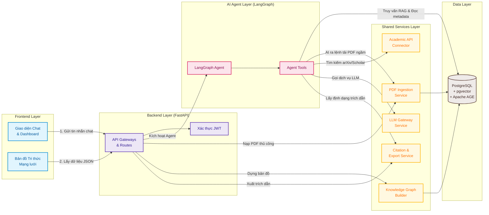
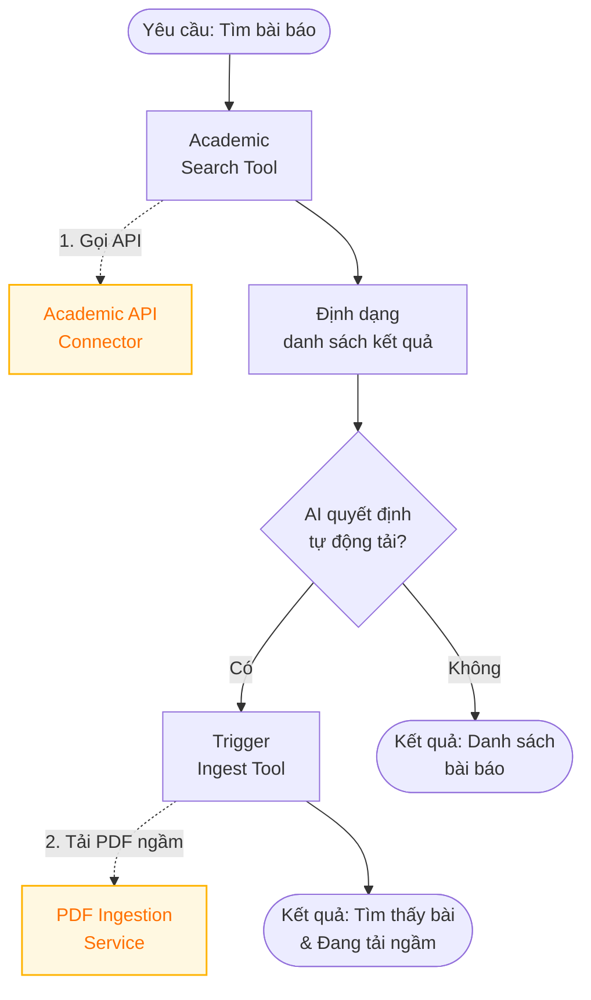
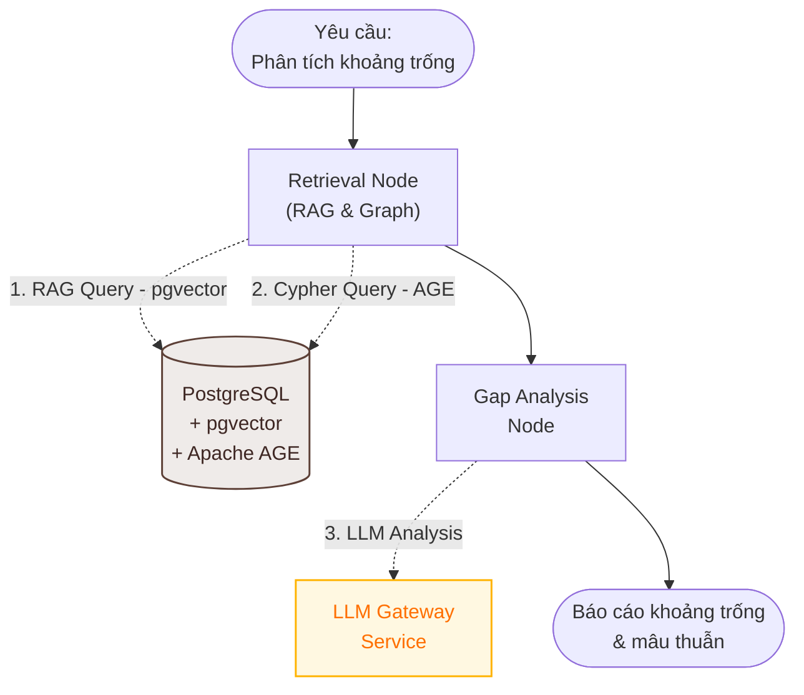
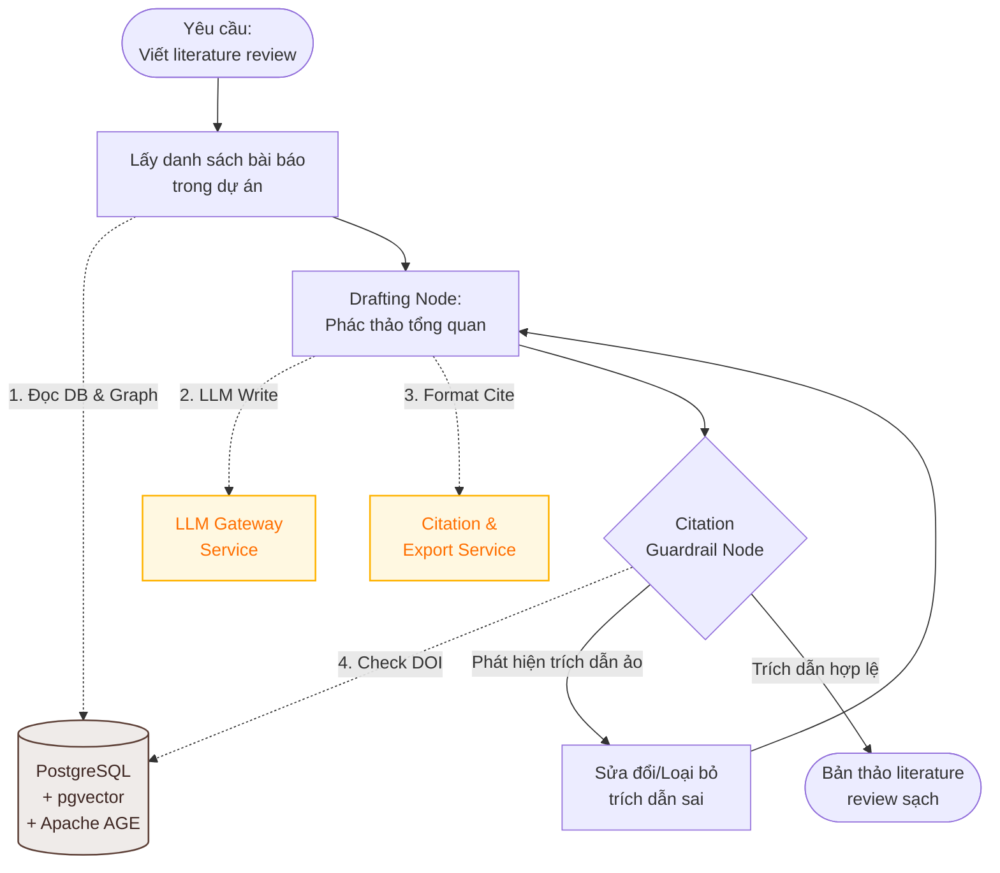

# Thiết kế Hệ thống và Danh sách Chức năng - AI Trợ Lý Tổng Quan Tài Liệu & Phát Hiện Khoảng Trống Nghiên Cứu (AI20K-031)

Bản thiết kế này mô tả chi tiết danh sách chức năng (Function List) và kiến trúc hệ thống (System Architecture) cho dự án AI Literature Review Assistant (Mã đề: AI20K-031), dựa trên template chuẩn `ARCHITECTURE.md` và các quy định của nhà trường.

## User Review Required

> [!IMPORTANT]
> **Các quyết định kiến trúc quan trọng cần được người dùng duyệt trước khi triển khai:**
> 1. **Academic API Key:** Chúng ta sẽ sử dụng Semantic Scholar API (cần API Key để nâng hạn mức nếu truy vấn nhiều, hoặc dùng public endpoint giới hạn) và arXiv API (không cần Key). Người dùng cần quyết định xem có đăng ký tài khoản Semantic Scholar API không hay dùng public limit.
> 2. **Authentication Method:** Đề tài yêu cầu phân quyền & quản lý User cơ bản. Chúng tôi đề xuất sử dụng JWT (JSON Web Tokens) lưu trong HttpOnly Cookie để đảm bảo bảo mật.
> 3. **UI Engine cho Bản đồ Tri thức (Knowledge Map):** Đề xuất sử dụng thư viện `cytoscape.js` (hoặc `react-force-graph`) ở Frontend React/Next.js để dựng bản đồ mạng lưới bài báo trực quan, tương tác được.

## Open Questions

> [!WARNING]
> **Các câu hỏi mở cần làm rõ:**
> - Bạn có cần hệ thống tự động tải PDF từ các trang có phí (ví dụ qua Sci-Hub hoặc thông qua tài khoản thư viện của bạn), hay chỉ hỗ trợ các bài báo Open Access (như arXiv, Semantic Scholar Open Access)? Hiện tại đề xuất chỉ tự động tải PDF Open Access, đối với bài có phí sẽ cho phép người dùng tự upload thủ công.

---

## Danh sách Chức năng (Function List)

### 1. Phân hệ Người dùng & Quản trị (User & Auth Management)
* **Đăng ký & Đăng nhập (Sign Up / Sign In):** Tạo tài khoản, đăng nhập hệ thống, cấp JWT token.
* **Quản lý thông tin cá nhân (Profile Management):** Đổi mật khẩu, cập nhật thông tin nghiên cứu viên.
* **Xác thực và Phân quyền:** Phân quyền cơ bản (Nghiên cứu viên thường và Quản trị viên hệ thống).

### 2. Phân hệ Quản lý Dự án Nghiên cứu (Literature Review Projects)
* **Tạo & Quản lý Không gian làm việc (Workspace/Project):** Mỗi dự án nghiên cứu tương ứng với một chủ đề (ví dụ: "Tối ưu hóa RAG bằng Graph", "Ứng dụng LLM trong Y tế").
* **Thêm mới/Xóa tài liệu trong Dự án:** Quản lý danh sách các bài báo liên quan thuộc dự án đó.
* **Xem lịch sử hội thoại của Dự án:** Lưu giữ lịch sử chat giữa người dùng và AI Agent theo từng dự án cụ thể.

### 3. Phân hệ Tìm kiếm và Thu thập Học thuật (Academic Search & Retrieval)
* **Tìm kiếm Đa nguồn (Multi-source Academic Search):** Tra cứu trực tiếp bài báo từ arXiv và Semantic Scholar qua API.
* **Quản lý Siêu dữ liệu bài báo (Metadata Management):** Lưu trữ tiêu đề, tác giả, tóm tắt, năm xuất bản, số lượng trích dẫn (citation count), DOI, link PDF và xuất định dạng trích dẫn BibTeX/APA.
* **Tự động tải PDF:** Tải file PDF từ các nguồn Open Access được liên kết để đưa vào pipeline xử lý RAG.

### 4. Phân hệ Xử lý Tài liệu & Vector Database (RAG Ingestion Pipeline)
* **Tải tài liệu thủ công:** Hỗ trợ người dùng tự upload file PDF của bài báo.
* **Phân tích PDF & Trích xuất văn bản (PDF Parsing & Chunking):** Sử dụng các thư viện Python chuyên dụng để trích xuất text từ PDF, phân chia đoạn thông minh theo cấu trúc mục (Introduction, Methodology, Results...).
* **Embedding & Vector Database Storage:** Sinh vector embeddings cho các chunk văn bản (OpenAI/Google Gemini) và lưu trữ trực tiếp vào PostgreSQL (sử dụng extension `pgvector`) để tìm kiếm tương đồng ngữ nghĩa.

### 5. Phân hệ AI Agent & Phân tích chuyên sâu (LangGraph Agentic Loop)
* **Tóm tắt & Phân nhóm (Summarize & Cluster):** Tóm tắt tự động bài báo theo phương pháp, hướng tiếp cận và kết quả. Phân nhóm các bài báo có phương pháp tương tự.
* **Phát hiện Khoảng trống & Mâu thuẫn (Gap & Contradiction Detection):** So sánh chéo các nghiên cứu để tìm ra sự mâu thuẫn trong kết quả hoặc các khoảng trống chưa được giải quyết.
* **Tạo bản thảo Literature Review:** Hỗ trợ viết văn bản tổng quan tài liệu có cấu trúc học thuật chặt chẽ.
* **Citation Guardrail (Chống ảo ảnh trích dẫn):** Bộ lọc tự động ki�### Sơ đồ Kiến trúc Tổng quan (System Overview Diagram)



### Sơ đồ Luồng xử lý của Agent (Agent Flow Diagram)

Dưới đây là sơ đồ chi tiết luồng suy luận tuần hoàn (agentic loop) trong LangGraph (phù hợp với Phương án A, quá trình tải và ingest tài liệu diễn ra ở tầng Backend):

### 1. Tìm kiếm học thuật & Tự động tải ngầm (Academic Search & Ingestion)


### 2. Phân tích so sánh & Khoảng trống nghiên cứu (Literature Gap Analysis)


### 3. Soạn thảo Literature Review & Kiểm định Trích dẫn (Drafting & Citation Guardrail)


## Đề xuất Thay đổi Files (Proposed Changes)

Khi bạn duyệt thiết kế này, chúng ta sẽ bắt tay vào chỉnh sửa cấu trúc source code của dự án theo mẫu của nhà trường.

### [Component: Documentation]

#### [MODIFY] [ARCHITECTURE.md](file:///home/agent/github/C2-App-053/ARCHITECTURE.md)
* Cập nhật file kiến trúc hệ thống chính của dự án dựa trên template mẫu có sẵn để mô tả đúng đề tài AI20K-031.

### [Component: API & Models]

#### [NEW] [schemas.py](file:///home/agent/github/C2-App-053/src/models/schemas.py)
* Định nghĩa các Pydantic models cho: `UserRegister`, `UserLogin`, `ProjectCreate`, `PaperSearchRequest`, `AgentChatRequest`, `AgentChatResponse`.

#### [MODIFY] [routes.py](file:///home/agent/github/C2-App-053/src/api/routes.py)
* Thêm các endpoint REST API:
  * `/auth/register` & `/auth/login` (Xác thực người dùng).
  * `/projects` (CRUD dự án nghiên cứu).
  * `/papers/search` (Tìm kiếm bài báo qua APIs).
  * `/papers/knowledge-map` (Lấy dữ liệu mạng lưới bài báo).
  * `/chat` & `/chat/stream` (Stream câu trả lời của LangGraph Agent).

### [Component: AI Agent (LangGraph)]

#### [NEW] [state.py](file:///home/agent/github/C2-App-053/src/agents/state.py)
* Định nghĩa `AgentState` chứa các thông tin trạng thái cần thiết: `messages`, `project_id`, `retrieved_papers`, `citation_map`, `draft_review`, `hallucination_score`.

#### [NEW] [nodes.py](file:///home/agent/github/C2-App-053/src/agents/nodes/nodes.py)
* Viết logic cho các Node: `router_node`, `retrieval_node`, `gap_analysis_node`, `citation_verification_node`, `drafting_node`.

#### [NEW] [academic_search.py](file:///home/agent/github/C2-App-053/src/agents/tools/academic_search.py)
* Viết công cụ tìm kiếm và lấy thông tin bài báo từ Semantic Scholar API và arXiv API.

#### [MODIFY] [graph.py](file:///home/agent/github/C2-App-053/src/agents/graph.py)
* Xây dựng sơ đồ trạng thái (StateGraph), định nghĩa các cạnh điều kiện (conditional edges) và compile Agent.

---

## Kịch bản Kiểm thử & Xác minh (Verification Plan)

### Kiểm thử tự động (Automated Tests)
* Chạy các unit test cho API và Agent:
  ```bash
  # Chạy test ruff kiểm tra code style
  make lint
  # Chạy unit tests cho các endpoint API và LangGraph Nodes
  pytest tests/
  ```

### Kiểm thử thủ công (Manual Verification)
1. **Tìm kiếm Học thuật:** Gọi API `/papers/search?query=RAG` và kiểm tra kết quả trả về từ arXiv/Semantic Scholar có đúng cấu trúc hay không.
2. **Citation Guardrail Test:** Gửi prompt yêu cầu viết literature review và cố ý ép Agent trích dẫn các tài liệu không tồn tại. Xác minh xem Citation Guardrail Node có phát hiện và loại bỏ các trích dẫn giả mạo đó không.
3. **Bản đồ Tri thức:** Xác minh API `/papers/knowledge-map` trả về đúng định dạng JSON danh sách đỉnh (nodes) và cạnh (edges) của đồ thị trích dẫn.
